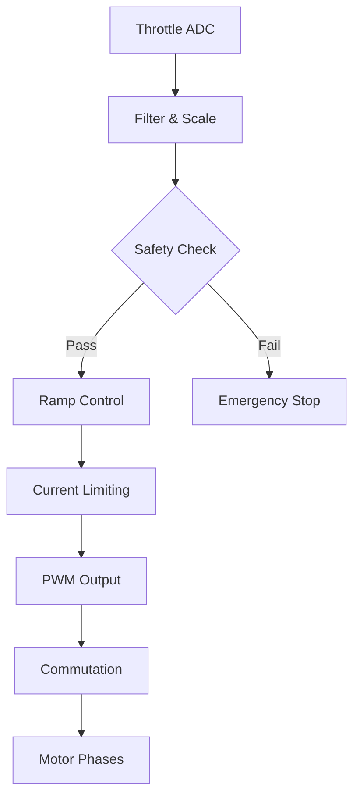

# ESC Motor Control

#esc #motor-control #throttle #ramp #safety

[[esc-commutation]] | [[esc-sensors]] | [[esc-safety]] | [[vcu-pedal]]

## Genel Bakış

Motor kontrol ana modülü. Throttle input'unu motor PWM duty cycle'ına dönüştürür, ramping kontrolü, current limiting ve güvenlik fonksiyonları sağlar.

> [!warning] Kritik Kontrol Modülü
> Bu modül motorun güvenli ve kontrollü çalışmasından sorumludur. Hatalı implementasyon güvenlik riskine yol açar.

## Motor Control Algorithm

### Control Flow


## Throttle Mapping

### ADC to Duty Cycle Conversion
```c
#define THROTTLE_ADC_MIN      200     // Minimum valid ADC (dead zone)
#define THROTTLE_ADC_MAX      3800    // Maximum valid ADC
#define THROTTLE_DEADZONE     100     // Dead zone around minimum
#define MAX_DUTY_CYCLE        9999    // Maximum PWM duty (99.99%)
#define MIN_DUTY_CYCLE        0       // Minimum PWM duty

typedef struct {
    uint16_t adc_raw;           // Raw ADC reading
    uint16_t adc_filtered;      // Filtered ADC reading
    float throttle_percent;     // Throttle percentage (0.0-1.0)
    uint16_t duty_cycle;        // PWM duty cycle (0-9999)
    bool valid;                 // Input validity flag
} Throttle_Data_t;
```

### Throttle Processing Function
```c
void Process_Throttle(void) {
    static Throttle_Data_t throttle;
    
    // Read raw ADC value
    throttle.adc_raw = ADC_Get_Throttle();
    
    // Apply exponential moving average filter (α = 0.1)
    throttle.adc_filtered = (uint16_t)(0.9f * throttle.adc_filtered + 
                                       0.1f * throttle.adc_raw);
    
    // Validate input range
    if (throttle.adc_filtered < THROTTLE_ADC_MIN || 
        throttle.adc_filtered > THROTTLE_ADC_MAX) {
        throttle.valid = false;
        Set_Fault(FAULT_THROTTLE_OUT_OF_RANGE);
        return;
    }
    
    // Apply dead zone
    if (throttle.adc_filtered < (THROTTLE_ADC_MIN + THROTTLE_DEADZONE)) {
        throttle.throttle_percent = 0.0f;
    } else {
        // Linear mapping from deadzone to max
        float range = THROTTLE_ADC_MAX - (THROTTLE_ADC_MIN + THROTTLE_DEADZONE);
        float offset = throttle.adc_filtered - (THROTTLE_ADC_MIN + THROTTLE_DEADZONE);
        throttle.throttle_percent = offset / range;
        
        // Clamp to [0.0, 1.0]
        if (throttle.throttle_percent > 1.0f) throttle.throttle_percent = 1.0f;
        if (throttle.throttle_percent < 0.0f) throttle.throttle_percent = 0.0f;
    }
    
    // Convert to duty cycle
    throttle.duty_cycle = (uint16_t)(throttle.throttle_percent * MAX_DUTY_CYCLE);
    throttle.valid = true;
}
```

### Throttle Curve Options
```c
typedef enum {
    THROTTLE_LINEAR,        // Linear response
    THROTTLE_PROGRESSIVE,   // Slow start, fast end
    THROTTLE_AGGRESSIVE     // Fast start, slow end  
} Throttle_Curve_t;

float Apply_Throttle_Curve(float input, Throttle_Curve_t curve) {
    switch (curve) {
        case THROTTLE_LINEAR:
            return input;
            
        case THROTTLE_PROGRESSIVE:
            // Quadratic curve (input^2)
            return input * input;
            
        case THROTTLE_AGGRESSIVE:
            // Square root curve
            return sqrtf(input);
            
        default:
            return input;
    }
}
```

## Ramp Control

### Acceleration/Deceleration Limiting
```c
#define RAMP_STEP_ACCEL       20      // Maximum acceleration step per cycle
#define RAMP_STEP_DECEL       50      // Maximum deceleration step per cycle  
#define RAMP_PERIOD_MS        5       // Ramp update period (200Hz)

typedef struct {
    uint16_t target_duty;       // Target duty cycle
    uint16_t current_duty;      // Current duty cycle
    uint16_t ramp_step;         // Current ramp step size
    uint32_t last_update;       // Last ramp update time
    bool ramping_up;            // Direction flag
} Ramp_Control_t;

static Ramp_Control_t ramp_ctrl;

void Update_Ramp_Control(uint16_t target_duty) {
    uint32_t current_time = HAL_GetTick();
    
    // Check if it's time to update ramp
    if (current_time - ramp_ctrl.last_update < RAMP_PERIOD_MS) {
        return;
    }
    
    ramp_ctrl.target_duty = target_duty;
    
    // Calculate difference
    int32_t duty_diff = (int32_t)ramp_ctrl.target_duty - 
                       (int32_t)ramp_ctrl.current_duty;
    
    if (duty_diff == 0) {
        // Already at target
        return;
    }
    
    // Determine ramp step based on direction
    if (duty_diff > 0) {
        // Ramping up (acceleration)
        ramp_ctrl.ramping_up = true;
        ramp_ctrl.ramp_step = RAMP_STEP_ACCEL;
    } else {
        // Ramping down (deceleration)
        ramp_ctrl.ramping_up = false;
        ramp_ctrl.ramp_step = RAMP_STEP_DECEL;
    }
    
    // Apply ramp step
    if (abs(duty_diff) <= ramp_ctrl.ramp_step) {
        // Close enough - jump to target
        ramp_ctrl.current_duty = ramp_ctrl.target_duty;
    } else {
        // Increment/decrement by ramp step
        if (ramp_ctrl.ramping_up) {
            ramp_ctrl.current_duty += ramp_ctrl.ramp_step;
        } else {
            ramp_ctrl.current_duty -= ramp_ctrl.ramp_step;
        }
    }
    
    ramp_ctrl.last_update = current_time;
}
```

### Emergency Ramp-Down
```c
void Emergency_Ramp_Down(void) {
    // Fast ramp-down for emergency situations
    const uint16_t EMERGENCY_STEP = 500;  // Large step for fast stop
    
    if (ramp_ctrl.current_duty > EMERGENCY_STEP) {
        ramp_ctrl.current_duty -= EMERGENCY_STEP;
    } else {
        ramp_ctrl.current_duty = 0;
    }
    
    // Update target to match for clean state
    ramp_ctrl.target_duty = ramp_ctrl.current_duty;
}
```

## Current Limiting

### Current Measurement & Filtering
```c
#define MAX_MOTOR_CURRENT_A   80.0f   // Maximum allowed motor current
#define CURRENT_LIMIT_HYST    5.0f    // Hysteresis for current limiting
#define CURRENT_FILTER_ALPHA  0.1f    // EMA filter coefficient

typedef struct {
    float current_raw;          // Raw current reading (A)
    float current_filtered;     // Filtered current (A)
    float current_max;          // Maximum allowed current
    bool limit_active;          // Current limiting active flag
    uint32_t limit_count;       // Count of limiting events
} Current_Control_t;

static Current_Control_t current_ctrl = {
    .current_max = MAX_MOTOR_CURRENT_A,
    .limit_active = false,
    .limit_count = 0
};

void Update_Current_Control(void) {
    // Read current from ADC
    current_ctrl.current_raw = ADC_Get_Motor_Current();
    
    // Apply exponential moving average filter
    current_ctrl.current_filtered = (1.0f - CURRENT_FILTER_ALPHA) * 
                                    current_ctrl.current_filtered +
                                    CURRENT_FILTER_ALPHA * 
                                    current_ctrl.current_raw;
    
    // Check for current limiting
    if (!current_ctrl.limit_active) {
        // Not currently limiting - check if we need to start
        if (current_ctrl.current_filtered > current_ctrl.current_max) {
            current_ctrl.limit_active = true;
            current_ctrl.limit_count++;
            Reduce_Motor_Power();
        }
    } else {
        // Currently limiting - check if we can release
        if (current_ctrl.current_filtered < 
            (current_ctrl.current_max - CURRENT_LIMIT_HYST)) {
            current_ctrl.limit_active = false;
        } else {
            // Continue limiting
            Reduce_Motor_Power();
        }
    }
}
```

### Power Reduction Strategy
```c
void Reduce_Motor_Power(void) {
    // Reduce duty cycle by 10% when current limiting is active
    if (ramp_ctrl.current_duty > 100) {
        ramp_ctrl.current_duty = (uint16_t)(ramp_ctrl.current_duty * 0.9f);
        
        // Also reduce target to prevent immediate ramp-up
        if (ramp_ctrl.target_duty > ramp_ctrl.current_duty) {
            ramp_ctrl.target_duty = ramp_ctrl.current_duty;
        }
    }
}
```

## Brake & Fault Handling

### Brake Input Processing
```c
bool Get_Brake_Status(void) {
    return HAL_GPIO_ReadPin(BRAKE_GPIO_Port, BRAKE_Pin);
}

void Process_Brake_Input(void) {
    static bool last_brake_state = false;
    bool current_brake_state = Get_Brake_Status();
    
    if (current_brake_state && !last_brake_state) {
        // Brake pressed - immediate stop
        Motor_Emergency_Stop();
        Set_State(MOTOR_STATE_BRAKE);
    } else if (!current_brake_state && last_brake_state) {
        // Brake released - return to ready state
        if (Get_Motor_State() == MOTOR_STATE_BRAKE) {
            Set_State(MOTOR_STATE_READY);
        }
    }
    
    last_brake_state = current_brake_state;
}
```

### Immediate Stop Function
```c
void Motor_Immediate_Stop(void) {
    // Immediately set duty to zero
    ramp_ctrl.current_duty = 0;
    ramp_ctrl.target_duty = 0;
    
    // Disable motor output
    Motor_Emergency_Stop();
    
    // Clear any pending ramp operations
    ramp_ctrl.last_update = HAL_GetTick();
}
```

## Motor Control State Machine

### State Definitions
```c
typedef enum {
    MOTOR_STATE_OFF,        // Motor disabled
    MOTOR_STATE_READY,      // Ready to drive
    MOTOR_STATE_DRIVE,      // Actively driving
    MOTOR_STATE_BRAKE,      // Brake applied
    MOTOR_STATE_FAULT       // Fault condition
} Motor_State_t;

typedef struct {
    Motor_State_t state;
    Motor_State_t prev_state;
    uint32_t state_entry_time;
    bool fault_active;
    uint32_t fault_code;
} Motor_Control_State_t;

static Motor_Control_State_t motor_state = {
    .state = MOTOR_STATE_OFF,
    .prev_state = MOTOR_STATE_OFF,
    .fault_active = false,
    .fault_code = 0
};
```

### State Transition Logic
```c
void Update_Motor_State_Machine(void) {
    Motor_State_t new_state = motor_state.state;
    
    switch (motor_state.state) {
        case MOTOR_STATE_OFF:
            // Can transition to READY if no faults and VCU is ready
            if (!motor_state.fault_active && Is_VCU_Ready()) {
                new_state = MOTOR_STATE_READY;
            }
            break;
            
        case MOTOR_STATE_READY:
            // Check for throttle input to enter DRIVE
            if (Get_Throttle_Percent() > 0.05f && !Get_Brake_Status()) {
                new_state = MOTOR_STATE_DRIVE;
            }
            
            // Check for faults
            if (motor_state.fault_active) {
                new_state = MOTOR_STATE_FAULT;
            }
            
            // Check for brake
            if (Get_Brake_Status()) {
                new_state = MOTOR_STATE_BRAKE;
            }
            break;
            
        case MOTOR_STATE_DRIVE:
            // Normal driving state
            if (Get_Throttle_Percent() <= 0.01f) {
                new_state = MOTOR_STATE_READY;
            }
            
            if (motor_state.fault_active || Get_Brake_Status()) {
                Motor_Immediate_Stop();
                new_state = (motor_state.fault_active) ? 
                           MOTOR_STATE_FAULT : MOTOR_STATE_BRAKE;
            }
            break;
            
        case MOTOR_STATE_BRAKE:
            // Brake applied - motor stopped
            if (!Get_Brake_Status() && !motor_state.fault_active) {
                new_state = MOTOR_STATE_READY;
            }
            
            if (motor_state.fault_active) {
                new_state = MOTOR_STATE_FAULT;
            }
            break;
            
        case MOTOR_STATE_FAULT:
            // Fault state - manual intervention required
            if (!motor_state.fault_active) {
                new_state = MOTOR_STATE_OFF;  // Require restart
            }
            break;
    }
    
    // Apply state change
    if (new_state != motor_state.state) {
        motor_state.prev_state = motor_state.state;
        motor_state.state = new_state;
        motor_state.state_entry_time = HAL_GetTick();
        
        // State entry actions
        switch (new_state) {
            case MOTOR_STATE_OFF:
            case MOTOR_STATE_FAULT:
                Motor_Immediate_Stop();
                break;
                
            case MOTOR_STATE_READY:
                // Clear any pending duty cycles
                ramp_ctrl.target_duty = 0;
                break;
                
            case MOTOR_STATE_DRIVE:
                // Enable motor output if not already enabled
                Motor_Enable_Output();
                break;
        }
    }
}
```

## Main Control Loop

### 200Hz Control Task
```c
void Motor_Control_Task(void) {
    static uint32_t last_run = 0;
    uint32_t current_time = HAL_GetTick();
    
    // Run at 200Hz (5ms period)
    if (current_time - last_run >= 5) {
        last_run = current_time;
        
        // 1. Read and process inputs
        Process_Throttle();
        Process_Brake_Input();
        
        // 2. Update current monitoring
        Update_Current_Control();
        
        // 3. Update state machine
        Update_Motor_State_Machine();
        
        // 4. Calculate target duty cycle
        uint16_t target_duty = 0;
        if (motor_state.state == MOTOR_STATE_DRIVE) {
            float throttle_pct = Get_Throttle_Percent();
            throttle_pct = Apply_Throttle_Curve(throttle_pct, THROTTLE_LINEAR);
            target_duty = (uint16_t)(throttle_pct * MAX_DUTY_CYCLE);
        }
        
        // 5. Update ramp control
        Update_Ramp_Control(target_duty);
        
        // 6. Apply to motor (if enabled and no faults)
        if (motor_state.state == MOTOR_STATE_DRIVE && 
            !motor_state.fault_active && !current_ctrl.limit_active) {
            
            uint8_t hall_state = Read_Hall_Sensors();
            Commutate_Motor(hall_state, ramp_ctrl.current_duty);
        } else {
            // Motor stopped or limited
            Motor_Emergency_Stop();
        }
    }
}
```

## Performance Monitoring

### Control Loop Timing
```c
typedef struct {
    uint32_t loop_count;
    uint32_t max_loop_time_us;
    uint32_t avg_loop_time_us;
    uint32_t missed_deadlines;
} Performance_Stats_t;

static Performance_Stats_t perf_stats;

void Monitor_Performance(void) {
    static uint32_t loop_start_time;
    uint32_t loop_end_time = DWT->CYCCNT;
    uint32_t loop_time_cycles = loop_end_time - loop_start_time;
    uint32_t loop_time_us = loop_time_cycles / 80;  // Assuming 80MHz clock
    
    // Update statistics
    perf_stats.loop_count++;
    
    if (loop_time_us > perf_stats.max_loop_time_us) {
        perf_stats.max_loop_time_us = loop_time_us;
    }
    
    // Simple moving average
    perf_stats.avg_loop_time_us = (perf_stats.avg_loop_time_us * 31 + 
                                   loop_time_us) / 32;
    
    // Check for deadline miss (should complete within 4ms for 5ms period)
    if (loop_time_us > 4000) {
        perf_stats.missed_deadlines++;
    }
    
    // Restart timing for next loop
    loop_start_time = DWT->CYCCNT;
}
```

### API Functions
```c
// Public interface functions
float Get_Throttle_Percent(void);
uint16_t Get_Current_Duty_Cycle(void);
Motor_State_t Get_Motor_State(void);
float Get_Motor_Current(void);
bool Is_Current_Limiting_Active(void);

// Configuration functions
void Set_Max_Current(float max_current_a);
void Set_Ramp_Rates(uint16_t accel_step, uint16_t decel_step);
void Set_Throttle_Curve(Throttle_Curve_t curve);

// Diagnostic functions
Performance_Stats_t Get_Performance_Stats(void);
Current_Control_t Get_Current_Control_Data(void);
Ramp_Control_t Get_Ramp_Control_Data(void);

// Safety functions
void Force_Motor_Stop(void);
void Clear_Motor_Faults(void);
bool Motor_Self_Test(void);
```

## Configuration Parameters

### Tuning Constants
```c
// Motor-specific parameters (adjustable)
#define MOTOR_POLE_PAIRS      7       // Motor pole pairs
#define MOTOR_MAX_RPM         3000    // Maximum RPM
#define MOTOR_KV              200     // Motor KV rating (RPM/V)

// Control loop tuning
#define CURRENT_LOOP_KP       0.5f    // Current loop proportional gain
#define CURRENT_LOOP_KI       0.1f    // Current loop integral gain
#define SPEED_LOOP_KP         0.2f    // Speed loop proportional gain

// Protection limits
#define MAX_MOTOR_TEMP_C      80      // Maximum motor temperature
#define MAX_CONTROLLER_TEMP_C 70      // Maximum controller temperature
#define MIN_BATTERY_VOLTAGE   36.0f   // Minimum battery voltage
#define MAX_BATTERY_VOLTAGE   52.0f   // Maximum battery voltage
```

## İlgili Dokümanlar
- [[esc-commutation]] - Motor commutation implementation
- [[esc-sensors]] - Sensor reading and processing
- [[esc-safety]] - Safety systems and fault handling
- [[vcu-pedal]] - Throttle input processing
- [[Test-Proseduru]] - Motor control testing procedures

## Referanslar
- Motor Control Theory and Applications (Mohan)
- STM32 Motor Control SDK Documentation  
- BLDC Motor Control Techniques (TI)
- Vector Control and Space Vector PWM (AN)