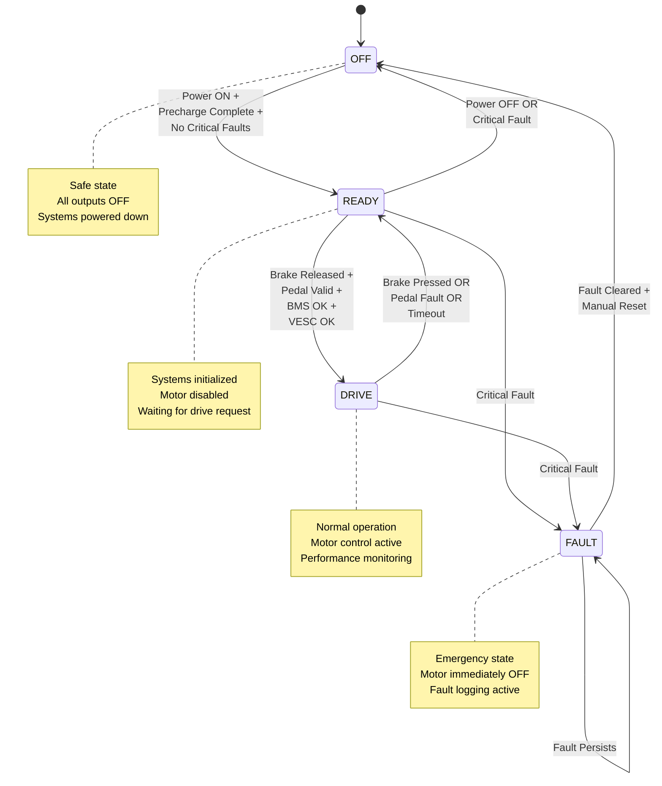

# VCU State Machine

> **Dosya:** `vcu_state.c` / `vcu_state.h`
> **Amaç:** Vehicle Control Unit ana durum yönetimi, güvenlik kontrolleri ve hata yönetimi
> **Safety Level:** ASIL-B equivalent

---

## 📊 State Diagram



---

## 🔧 Data Structures

### VCU_State_t
```c
typedef enum {
    VCU_STATE_OFF   = 0,    // System OFF, safe state
    VCU_STATE_READY = 1,    // Ready to drive, motor disabled
    VCU_STATE_DRIVE = 2,    // Active driving, motor enabled
    VCU_STATE_FAULT = 3     // Fault state, immediate shutdown
} VCU_State_t;
```

### StateMachine_t
```c
typedef struct {
    VCU_State_t current_state;      // Mevcut durum
    VCU_State_t previous_state;     // Önceki durum (recovery için)
    uint32_t    state_enter_time;   // Bu duruma girme zamanı (ms)
    uint32_t    time_in_state;      // Bu durumda geçen süre (ms)
    uint32_t    fault_flags;        // Aktif hata bayrakları
    uint32_t    warning_flags;      // Uyarı bayrakları (kritik olmayan)
    uint8_t     transition_count;   // Durum değişim sayısı (debugging için)
    
    // Timeout tracking
    uint32_t    bms_last_rx_time;   // Son BMS mesaj zamanı
    uint32_t    vesc_last_rx_time;  // Son VESC mesaj zamanı
    uint32_t    precharge_start_time; // Precharge başlama zamanı
    
    // Input states
    uint8_t     brake_pressed;      // Fren basılı mı?
    uint8_t     pedal_valid;        // Pedal geçerli mi?
    uint8_t     bms_ok;             // BMS haberleşme OK mi?
    uint8_t     vesc_ok;            // VESC haberleşme OK mi?
    uint8_t     precharge_complete; // Precharge tamamlandı mı?
    
} StateMachine_t;
```

### Fault Codes
```c
// Critical faults (immediate FAULT state)
typedef enum {
    FAULT_NONE              = 0x00000000,
    
    // Pedal faults (0x01-0x0F)
    FAULT_PEDAL_WIRE_BREAK  = 0x00000001,
    FAULT_PEDAL_SHORT       = 0x00000002,
    FAULT_PEDAL_OUT_RANGE   = 0x00000004,
    FAULT_PEDAL_IMPLAUSIBLE = 0x00000008,  // Pedal + brake simultaneously
    
    // Communication timeouts (0x10-0x1F)
    FAULT_BMS_TIMEOUT       = 0x00000010,
    FAULT_VESC_TIMEOUT      = 0x00000020,
    FAULT_CAN_BUS_OFF       = 0x00000040,
    
    // Motor/ESC faults (0x100-0x1FF) - imported from ESC modules
    FAULT_ESC_OVERCURRENT   = 0x00000100,
    FAULT_ESC_OVERTEMP      = 0x00000200,
    FAULT_ESC_HALL_FAULT    = 0x00000400,
    FAULT_ESC_MOTOR_STALL   = 0x00000800,
    
    // BMS faults (0x200-0x2FF)
    FAULT_BMS_UNDERVOLTAGE  = 0x00001000,
    FAULT_BMS_OVERVOLTAGE   = 0x00002000,
    FAULT_BMS_OVERTEMP      = 0x00004000,
    FAULT_BMS_OVERCURRENT   = 0x00008000,
    FAULT_BMS_CELL_IMBAL    = 0x00010000,
    
    // Hardware faults (0x8000+)
    FAULT_PRECHARGE_TIMEOUT = 0x00020000,
    FAULT_CONTACTOR_WELD    = 0x00040000,
    FAULT_INSULATION        = 0x00080000,
    FAULT_EMERGENCY_STOP    = 0x00100000,
    
    // System faults
    FAULT_WATCHDOG          = 0x80000000
} VCU_FaultCode_t;

// Warning flags (non-critical)
typedef enum {
    WARNING_NONE            = 0x00000000,
    WARNING_LOW_BATTERY     = 0x00000001,
    WARNING_HIGH_TEMP       = 0x00000002,
    WARNING_REDUCED_POWER   = 0x00000004,
    WARNING_MAINTENANCE     = 0x00000008
} VCU_WarningCode_t;
```

---

## ⏰ Timeout Constants

```c
// Communication timeouts
#define BMS_TIMEOUT_MS          500    // BMS maximum silence time
#define VESC_TIMEOUT_MS         200    // VESC maximum silence time
#define CAN_ERROR_TIMEOUT_MS   1000    // CAN bus error recovery time

// State timeouts
#define PRECHARGE_TIMEOUT_MS   5000    // Precharge maximum time
#define FAULT_RECOVERY_MS      2000    // Minimum time in FAULT state
#define DRIVE_ENTRY_DELAY_MS    100    // Delay before entering DRIVE

// Pedal plausibility
#define PEDAL_BRAKE_CHECK_MS    100    // Pedal+brake conflict check time
#define BRAKE_DEBOUNCE_MS        50    // Brake input debounce time
```

---

## 📚 Function Prototypes

### Core State Machine
```c
/**
 * @brief Initialize state machine
 * @param sm Pointer to StateMachine_t structure
 * @return HAL_StatusTypeDef
 */
HAL_StatusTypeDef VCU_State_Init(StateMachine_t *sm);

/**
 * @brief Update state machine (call every cycle)
 * @param sm Pointer to StateMachine_t structure
 * @return HAL_StatusTypeDef
 */
HAL_StatusTypeDef VCU_State_Update(StateMachine_t *sm);

/**
 * @brief Get current state
 * @param sm Pointer to StateMachine_t structure
 * @return VCU_State_t Current state
 */
VCU_State_t VCU_State_Get(StateMachine_t *sm);

/**
 * @brief Force state transition (emergency use only)
 * @param sm Pointer to StateMachine_t structure
 * @param new_state Target state
 * @return HAL_StatusTypeDef
 */
HAL_StatusTypeDef VCU_State_ForceTransition(StateMachine_t *sm, VCU_State_t new_state);
```

### Fault Management
```c
/**
 * @brief Set fault flag
 * @param sm Pointer to StateMachine_t structure  
 * @param fault_code Fault code to set
 * @return HAL_StatusTypeDef
 */
HAL_StatusTypeDef VCU_State_SetFault(StateMachine_t *sm, uint32_t fault_code);

/**
 * @brief Clear fault flag
 * @param sm Pointer to StateMachine_t structure
 * @param fault_code Fault code to clear
 * @return HAL_StatusTypeDef
 */
HAL_StatusTypeDef VCU_State_ClearFault(StateMachine_t *sm, uint32_t fault_code);

/**
 * @brief Check if any critical fault is active
 * @param sm Pointer to StateMachine_t structure
 * @return uint8_t 1 if fault exists, 0 otherwise
 */
uint8_t VCU_State_HasCriticalFault(StateMachine_t *sm);

/**
 * @brief Get active fault codes
 * @param sm Pointer to StateMachine_t structure
 * @return uint32_t Bitfield of active faults
 */
uint32_t VCU_State_GetFaults(StateMachine_t *sm);
```

### Input Updates
```c
/**
 * @brief Update brake pedal status
 * @param sm Pointer to StateMachine_t structure
 * @param brake_pressed 1 if brake is pressed, 0 otherwise
 */
void VCU_State_UpdateBrake(StateMachine_t *sm, uint8_t brake_pressed);

/**
 * @brief Update throttle pedal status
 * @param sm Pointer to StateMachine_t structure
 * @param pedal_percent Pedal percentage (0-100)
 * @param pedal_fault Pedal fault flags
 */
void VCU_State_UpdatePedal(StateMachine_t *sm, float pedal_percent, uint8_t pedal_fault);

/**
 * @brief Update BMS communication status
 * @param sm Pointer to StateMachine_t structure
 * @param bms_data Pointer to BMS data structure
 */
void VCU_State_UpdateBMS(StateMachine_t *sm, BMS_Data_t *bms_data);

/**
 * @brief Update VESC communication status  
 * @param sm Pointer to StateMachine_t structure
 * @param vesc_data Pointer to VESC data structure
 */
void VCU_State_UpdateVESC(StateMachine_t *sm, VESC_Data_t *vesc_data);
```

---

## 💻 Implementation Details

### VCU_State_Init
```c
HAL_StatusTypeDef VCU_State_Init(StateMachine_t *sm) {
    if (sm == NULL) return HAL_ERROR;
    
    // Initialize to safe state
    sm->current_state = VCU_STATE_OFF;
    sm->previous_state = VCU_STATE_OFF;
    sm->state_enter_time = HAL_GetTick();
    sm->time_in_state = 0;
    sm->fault_flags = FAULT_NONE;
    sm->warning_flags = WARNING_NONE;
    sm->transition_count = 0;
    
    // Initialize timeouts
    sm->bms_last_rx_time = 0;
    sm->vesc_last_rx_time = 0;
    sm->precharge_start_time = 0;
    
    // Initialize inputs to safe state
    sm->brake_pressed = 1;      // Assume brake pressed until confirmed
    sm->pedal_valid = 0;        // Assume pedal invalid until confirmed
    sm->bms_ok = 0;             // No BMS communication yet
    sm->vesc_ok = 0;            // No VESC communication yet
    sm->precharge_complete = 0; // Precharge not done
    
    return HAL_OK;
}
```

### VCU_State_Update
```c
HAL_StatusTypeDef VCU_State_Update(StateMachine_t *sm) {
    if (sm == NULL) return HAL_ERROR;
    
    uint32_t current_time = HAL_GetTick();
    sm->time_in_state = current_time - sm->state_enter_time;
    
    // Check for communication timeouts
    _CheckTimeouts(sm, current_time);
    
    // Check for pedal plausibility
    _CheckPedalPlausibility(sm);
    
    // State machine logic
    VCU_State_t next_state = sm->current_state;
    
    switch (sm->current_state) {
        case VCU_STATE_OFF:
            next_state = _HandleStateOff(sm);
            break;
            
        case VCU_STATE_READY:
            next_state = _HandleStateReady(sm);
            break;
            
        case VCU_STATE_DRIVE:
            next_state = _HandleStateDrive(sm);
            break;
            
        case VCU_STATE_FAULT:
            next_state = _HandleStateFault(sm);
            break;
            
        default:
            // Invalid state - force to OFF
            next_state = VCU_STATE_OFF;
            VCU_State_SetFault(sm, FAULT_WATCHDOG);
            break;
    }
    
    // Execute state transition if needed
    if (next_state != sm->current_state) {
        _TransitionToState(sm, next_state);
    }
    
    return HAL_OK;
}
```

### State Handler Functions
```c
static VCU_State_t _HandleStateOff(StateMachine_t *sm) {
    // State entry actions
    static uint8_t entry_done = 0;
    if (!entry_done) {
        // Disable all outputs
        ESC_Motor_Disable();
        ESC_Safety_EmergencyStop();
        
        // Reset some faults that can be cleared by power cycle
        sm->fault_flags &= ~(FAULT_CAN_BUS_OFF | FAULT_WATCHDOG);
        
        entry_done = 1;
    }
    
    // Transition conditions to READY
    if (!VCU_State_HasCriticalFault(sm) && 
        sm->precharge_complete &&
        sm->bms_ok) {
        
        entry_done = 0;  // Reset for next entry
        return VCU_STATE_READY;
    }
    
    return VCU_STATE_OFF;
}

static VCU_State_t _HandleStateReady(StateMachine_t *sm) {
    static uint8_t entry_done = 0;
    if (!entry_done) {
        // Initialize systems
        ESC_Motor_Init();
        ESC_Safety_ResetFaults();
        
        // Start precharge if needed
        if (!sm->precharge_complete) {
            sm->precharge_start_time = HAL_GetTick();
            // Hardware precharge control here
        }
        
        entry_done = 1;
    }
    
    // Check for critical faults first
    if (VCU_State_HasCriticalFault(sm)) {
        entry_done = 0;
        return VCU_STATE_FAULT;
    }
    
    // Transition to DRIVE conditions
    if (!sm->brake_pressed &&           // Brake released
        sm->pedal_valid &&              // Pedal working
        sm->bms_ok &&                   // BMS communication OK
        sm->vesc_ok &&                  // VESC communication OK
        sm->precharge_complete &&       // Precharge done
        sm->time_in_state > DRIVE_ENTRY_DELAY_MS) {  // Debounce delay
        
        entry_done = 0;
        return VCU_STATE_DRIVE;
    }
    
    // Stay in READY
    return VCU_STATE_READY;
}

static VCU_State_t _HandleStateDrive(StateMachine_t *sm) {
    static uint8_t entry_done = 0;
    if (!entry_done) {
        // Enable motor control
        ESC_Motor_Enable();
        ESC_Safety_ClearEmergencyStop();
        
        entry_done = 1;
    }
    
    // Immediate transition to FAULT on critical fault
    if (VCU_State_HasCriticalFault(sm)) {
        entry_done = 0;
        return VCU_STATE_FAULT;
    }
    
    // Transition back to READY conditions
    if (sm->brake_pressed ||            // Brake pressed
        !sm->pedal_valid ||             // Pedal fault
        !sm->bms_ok ||                  // BMS timeout
        !sm->vesc_ok) {                 // VESC timeout
        
        entry_done = 0;
        return VCU_STATE_READY;
    }
    
    // Continue driving
    return VCU_STATE_DRIVE;
}

static VCU_State_t _HandleStateFault(StateMachine_t *sm) {
    static uint8_t entry_done = 0;
    if (!entry_done) {
        // Immediate safety actions
        ESC_Motor_EmergencyStop();
        ESC_Safety_EmergencyStop();
        
        // Log fault entry
        VCU_Telemetry_LogFault(sm->fault_flags);
        
        entry_done = 1;
    }
    
    // Stay in FAULT until:
    // 1. All critical faults are cleared
    // 2. Minimum time in fault state has elapsed
    // 3. Manual reset is performed (implementation specific)
    
    if (!VCU_State_HasCriticalFault(sm) && 
        sm->time_in_state > FAULT_RECOVERY_MS) {
        
        entry_done = 0;
        return VCU_STATE_OFF;  // Return to safe state
    }
    
    return VCU_STATE_FAULT;
}
```

### Helper Functions
```c
static void _CheckTimeouts(StateMachine_t *sm, uint32_t current_time) {
    // BMS timeout check
    if (sm->bms_last_rx_time > 0 && 
        (current_time - sm->bms_last_rx_time) > BMS_TIMEOUT_MS) {
        VCU_State_SetFault(sm, FAULT_BMS_TIMEOUT);
        sm->bms_ok = 0;
    }
    
    // VESC timeout check
    if (sm->vesc_last_rx_time > 0 && 
        (current_time - sm->vesc_last_rx_time) > VESC_TIMEOUT_MS) {
        VCU_State_SetFault(sm, FAULT_VESC_TIMEOUT);
        sm->vesc_ok = 0;
    }
    
    // Precharge timeout check
    if (sm->precharge_start_time > 0 && 
        !sm->precharge_complete &&
        (current_time - sm->precharge_start_time) > PRECHARGE_TIMEOUT_MS) {
        VCU_State_SetFault(sm, FAULT_PRECHARGE_TIMEOUT);
    }
}

static void _CheckPedalPlausibility(StateMachine_t *sm) {
    static uint32_t conflict_start = 0;
    
    // Check for pedal + brake conflict (FSAE rule)
    if (sm->brake_pressed && sm->pedal_valid) {
        if (conflict_start == 0) {
            conflict_start = HAL_GetTick();
        } else if ((HAL_GetTick() - conflict_start) > PEDAL_BRAKE_CHECK_MS) {
            VCU_State_SetFault(sm, FAULT_PEDAL_IMPLAUSIBLE);
        }
    } else {
        conflict_start = 0;  // Reset conflict timer
    }
}

static void _TransitionToState(StateMachine_t *sm, VCU_State_t new_state) {
    sm->previous_state = sm->current_state;
    sm->current_state = new_state;
    sm->state_enter_time = HAL_GetTick();
    sm->transition_count++;
    
    // Log state transition for debugging
    VCU_Telemetry_LogStateTransition(sm->previous_state, new_state, sm->fault_flags);
}
```

---

## 📋 State Transition Table

| Current State | Condition | Next State | Actions |
|---------------|-----------|------------|---------|
| **OFF** | Power ON + Precharge Complete + No Critical Faults | READY | Initialize systems, enable monitoring |
| **OFF** | Critical Fault | OFF | Remain in safe state |
| **READY** | Brake Released + Pedal Valid + BMS OK + VESC OK | DRIVE | Enable motor control |
| **READY** | Critical Fault | FAULT | Emergency stop |
| **DRIVE** | Brake Pressed OR Pedal Fault OR Timeout | READY | Disable motor, return to ready |
| **DRIVE** | Critical Fault | FAULT | Emergency stop |
| **FAULT** | All Faults Cleared + Timeout + Manual Reset | OFF | Return to safe state |
| **Any** | Emergency Stop | FAULT | Immediate safety action |

---

## 🧪 State Machine Testing

### Test Cases

#### TC1: Normal Operation Sequence
```c
void Test_NormalSequence(void) {
    StateMachine_t sm;
    VCU_State_Init(&sm);
    
    // Test 1: Start in OFF state
    assert(VCU_State_Get(&sm) == VCU_STATE_OFF);
    
    // Test 2: Precharge complete + BMS OK → READY
    sm.precharge_complete = 1;
    sm.bms_ok = 1;
    VCU_State_Update(&sm);
    assert(VCU_State_Get(&sm) == VCU_STATE_READY);
    
    // Test 3: Brake release + pedal valid → DRIVE
    sm.brake_pressed = 0;
    sm.pedal_valid = 1;
    sm.vesc_ok = 1;
    HAL_Delay(DRIVE_ENTRY_DELAY_MS + 10);
    VCU_State_Update(&sm);
    assert(VCU_State_Get(&sm) == VCU_STATE_DRIVE);
    
    // Test 4: Brake press → READY
    sm.brake_pressed = 1;
    VCU_State_Update(&sm);
    assert(VCU_State_Get(&sm) == VCU_STATE_READY);
}
```

#### TC2: Fault Handling
```c
void Test_FaultHandling(void) {
    StateMachine_t sm;
    VCU_State_Init(&sm);
    
    // Setup for DRIVE state
    // ... (setup code)
    
    // Inject critical fault
    VCU_State_SetFault(&sm, FAULT_ESC_OVERCURRENT);
    VCU_State_Update(&sm);
    assert(VCU_State_Get(&sm) == VCU_STATE_FAULT);
    
    // Clear fault and wait
    VCU_State_ClearFault(&sm, FAULT_ESC_OVERCURRENT);
    HAL_Delay(FAULT_RECOVERY_MS + 10);
    VCU_State_Update(&sm);
    assert(VCU_State_Get(&sm) == VCU_STATE_OFF);
}
```

#### TC3: Timeout Testing
```c
void Test_Timeouts(void) {
    StateMachine_t sm;
    VCU_State_Init(&sm);
    
    // Setup communication
    sm.bms_last_rx_time = HAL_GetTick();
    sm.bms_ok = 1;
    
    // Simulate timeout
    HAL_Delay(BMS_TIMEOUT_MS + 10);
    VCU_State_Update(&sm);
    
    assert(VCU_State_HasCriticalFault(&sm));
    assert(sm.fault_flags & FAULT_BMS_TIMEOUT);
}
```

---

## 🔧 Integration with Other Modules

### Motor Control Integration
```c
// In main loop
void VCU_MainLoop(void) {
    // Update state machine
    VCU_State_Update(&state_machine);
    
    // Control motor based on state
    switch (VCU_State_Get(&state_machine)) {
        case VCU_STATE_OFF:
        case VCU_STATE_READY:
        case VCU_STATE_FAULT:
            ESC_Motor_SetDuty(0);  // Motor OFF
            break;
            
        case VCU_STATE_DRIVE:
            if (VCU_Pedal_HasFault(&pedal)) {
                ESC_Motor_SetDuty(0);
            } else {
                float pedal_percent = VCU_Pedal_GetPercent(&pedal);
                uint16_t motor_duty = ESC_Motor_MapPedal(pedal_percent);
                ESC_Motor_SetDuty(motor_duty);
            }
            break;
    }
}
```

### CAN Message Integration
```c
// Send state via CAN (0x300 VCU Status)
void VCU_CAN_SendStatus(StateMachine_t *sm) {
    CAN_TxHeaderTypeDef header;
    uint8_t data[8];
    
    header.StdId = 0x300;
    header.RTR = CAN_RTR_DATA;
    header.IDE = CAN_ID_STD;
    header.DLC = 8;
    
    data[0] = (uint8_t)sm->current_state;
    data[1] = (uint8_t)sm->previous_state;
    data[2] = (uint8_t)(sm->fault_flags >> 0);
    data[3] = (uint8_t)(sm->fault_flags >> 8);
    data[4] = (uint8_t)(sm->fault_flags >> 16);
    data[5] = (uint8_t)(sm->fault_flags >> 24);
    data[6] = sm->transition_count;
    data[7] = (uint8_t)(sm->time_in_state / 100);  // In 100ms units
    
    HAL_CAN_AddTxMessage(&hcan1, &header, data, &mailbox);
}
```

---

## 🏷️ Tags
#yazilim #vcu #state-machine #safety #fault-handling #fsae #asil-b

## 🔗 İlgili Dosyalar
- [[vcu-pedal]] - Pedal fault kodlarının state machine'e etkisi  
- [[esc-safety]] - ESC fault kodlarının entegrasyonu
- [[vcu-can]] - State ve fault verilerinin CAN üzerinden iletimi
- [[Test-Proseduru]] - State machine geçiş testleri

## ⚠️ Safety Notes

> [!DANGER] Kritik Güvenlik Kuralları
> - FAULT state'inde MUTLAKA motor çıkışı kesilmeli
> - Pedal + fren eşzamanlı basılması yasak (FSAE kuralı)
> - Communication timeout'ları agresif tutulmalı
> - State transition log'ları MUTLAKA kaydedilmeli

> [!WARNING] Watchdog Integration
> - State machine güncelleme döngüsü watchdog ile korunmalı
> - Sonsuz döngüye girme riski var
> - Invalid state detection kritik

> [!INFO] Debugging Tips
> - State transition'ları CAN/UART üzerinden log'layın
> - Fault flag'leri bit seviyesinde analiz edin  
> - Zaman damgalarını millisaniye hassasiyetle kaydedin
> - Test sırasında manuel fault injection kullanın