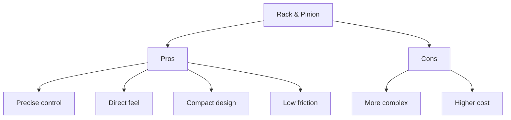
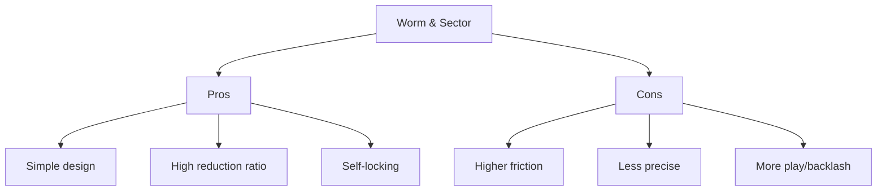
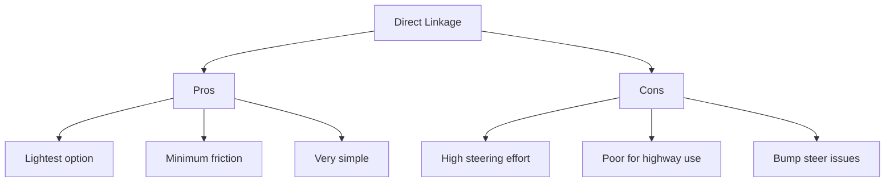
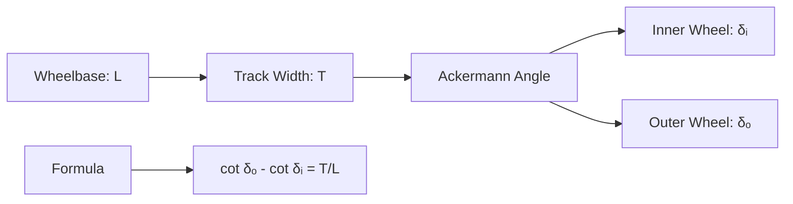
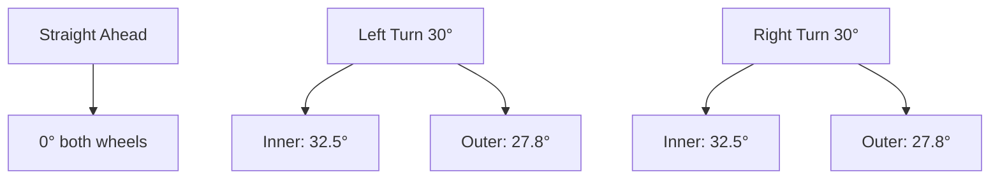
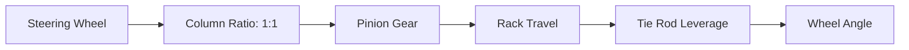
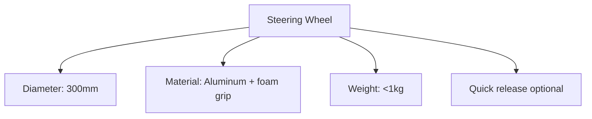
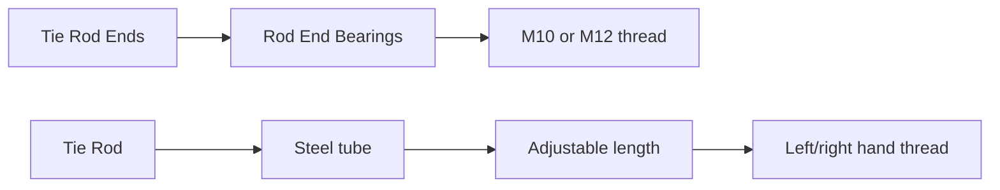

# Direksiyon Sistemi

#mekanik #direksiyon #ackermann #geometry

## Genel Bakış

Efficiency Challenge için hafif, responsive direksiyon sistemi. Ackermann geometry ile optimum turning, minimal drag.

> [!note] Hedefler
> - **Tip:** Rack and pinion (önerilen)
> - **Steering ratio:** 12:1 - 15:1
> - **Lock-to-lock:** 3.0 - 3.5 turns
> - **Ağırlık:** <5kg total sistem

## Steering Type Options

### 1. Rack and Pinion (Recommended)


**Specs:**
- **Rack travel:** 80-120mm total
- **Pinion diameter:** 25-35mm
- **Material:** Steel rack, aluminum housing
- **Maliyet:** ₺1500-3000

### 2. Worm and Sector


**Use case:** Budget option, easier manufacturing

### 3. Direct Linkage


**Use case:** Ultra-lightweight builds only

## Ackermann Geometry

### Geometry Calculation



**Given:**
- **Wheelbase (L):** 2000mm
- **Track width (T):** 1300mm
- **Ackermann factor:** T/L = 1300/2000 = 0.65

**Tie rod geometry:**
- **Tie rod length:** Calculate for Ackermann
- **Pickup points:** Behind axle centerline
- **Angle:** ~5-8° from centerline at straight ahead

### Practical Implementation



**Verification:**
- Measure actual angles with protractor
- Check tire scrub marks in testing
- Adjust tie rod lengths if needed

## Steering Ratio

### Calculation
```
Steering Ratio = (Steering Wheel Rotation) / (Front Wheel Rotation)
```

**Target values:**
- **Racing:** 12:1 - 14:1 (quick response)
- **Comfort:** 15:1 - 17:1 (easier at parking speeds)
- **Our target:** 13:1 - 15:1

### Ratio Factors


**Components:**
- **Steering wheel:** 300-350mm diameter
- **Pinion gear:** 12-16 teeth (smaller = quicker)
- **Rack pitch:** 2-3mm per tooth
- **Tie rod geometry:** Affects leverage ratio

## Components

### Steering Wheel


**Specs:**
- **Diameter:** 300-320mm (compromise size/leverage)
- **Material:** Aluminum rim + urethane/foam grip
- **Hub:** 3-bolt or 6-bolt pattern
- **Weight:** <1kg
- **Features:** Optional quick-release for driver access

### Steering Column
- **Type:** Adjustable tilt (optional)
- **Material:** Steel tube (seamless)
- **Diameter:** 25-30mm OD
- **Length:** 400-600mm
- **Bearings:** Sealed ball bearings top/bottom
- **U-joints:** Double Cardan joint for angle changes

### Tie Rods


**Specifications:**
- **Rod ends:** M10 or M12 male/female threads
- **Material:** Steel, chromoly preferred
- **Adjustment:** Left-hand and right-hand threads
- **Length:** Calculate for geometry + adjustment range

### Ball Joints
- **Type:** Maintenance-free sealed units
- **Load rating:** Min 500kg radial
- **Material:** Steel ball, polymer socket
- **Grease:** Sealed for life
- **Mounting:** Taper fit to knuckle

## Build Checklist

### Design Phase
- [ ] Wheelbase and track width finalized
- [ ] Ackermann geometry calculated
- [ ] Steering ratio determined
- [ ] Rack and pinion sizing completed
- [ ] Component selection finalized
- [ ] Weight budget allocated (<5kg)

### Procurement
- [ ] Rack and pinion unit sourced
- [ ] Steering wheel selected
- [ ] Steering column components
- [ ] Tie rod ends (4x minimum)
- [ ] Tie rod tubes (2x adjustable)
- [ ] Ball joints for knuckles
- [ ] Mounting brackets material
- [ ] Fasteners and hardware

### Manufacturing
- [ ] Rack mounting brackets fabricated
- [ ] Column mounting brackets made
- [ ] Column tube cut to length
- [ ] U-joint connections machined
- [ ] Tie rod tubes cut and threaded

### Assembly
- [ ] Rack mounted to chassis
- [ ] Column installed and aligned
- [ ] Pinion gear engagement verified
- [ ] Tie rods assembled and adjusted
- [ ] Ball joints installed to knuckles
- [ ] Steering wheel mounted

### Alignment & Geometry
- [ ] Front wheels straight ahead verified
- [ ] Steering wheel centered
- [ ] Toe adjustment completed
- [ ] Ackermann angles measured and verified
- [ ] Lock-to-lock travel checked
- [ ] Bump steer test completed

### Testing
- [ ] Steering effort measurement
- [ ] Free play/backlash check (<5°)
- [ ] Full lock testing (no binding)
- [ ] Dynamic test (low speed maneuvering)
- [ ] High-speed stability verification
- [ ] Emergency maneuver testing

### Competition Prep
- [ ] All fasteners double-checked and torqued
- [ ] Tie rod adjustment locks secured
- [ ] Grease all serviceable joints
- [ ] Spare tie rod ends packed
- [ ] Alignment tools ready for setup
- [ ] Quick-release steering wheel practice

### Performance Optimization
- [ ] Steering effort optimization
- [ ] Geometry fine-tuning based on testing
- [ ] Friction reduction (bearings, joints)
- [ ] Weight reduction review
- [ ] Driver feedback incorporation

---

**Related:** [[Sasi]] | [[Suspansiyon]] | [[Tekerlekler]]
**Tags:** #mekanik #direksiyon #ackermann #geometry
**Owner:** Teknik Çizim team
**Dependencies:** Chassis design, front suspension layout
**Status:** Design phase
**Last updated:** {{date}}