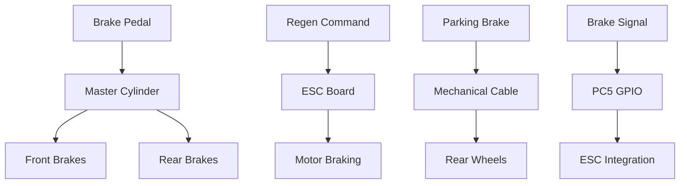
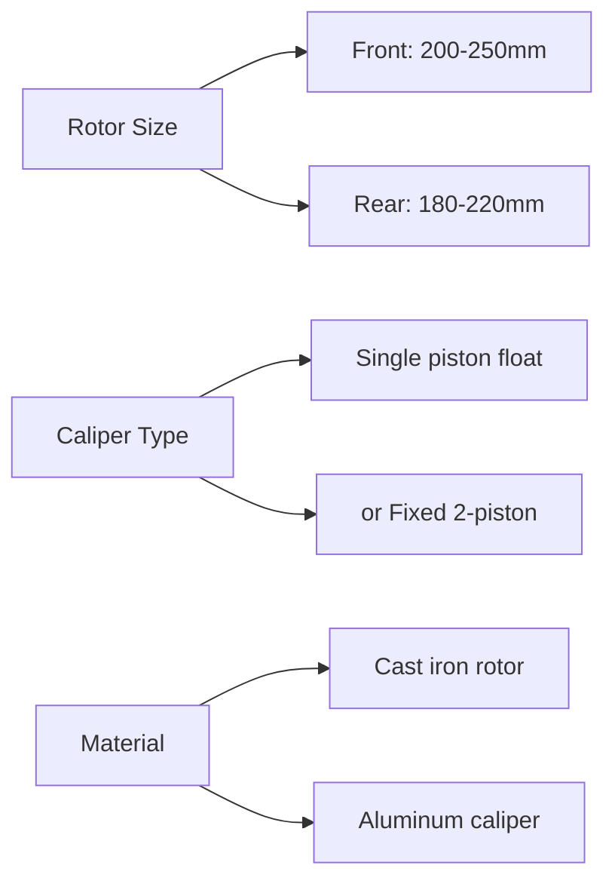
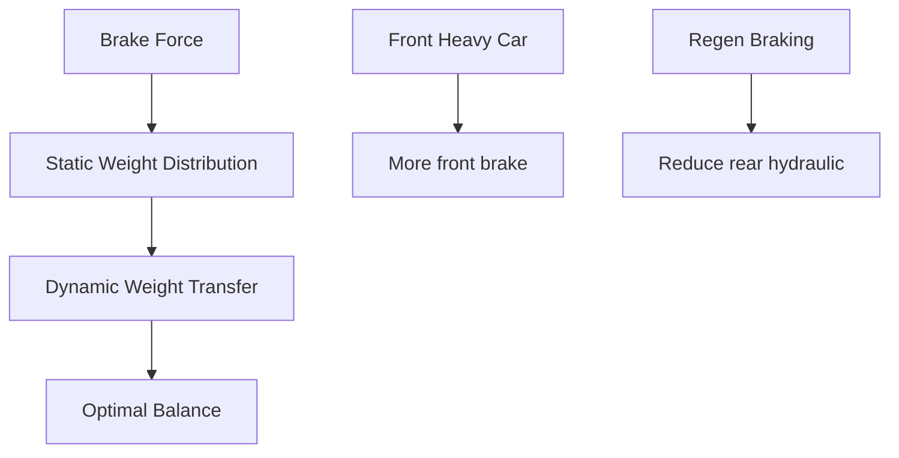
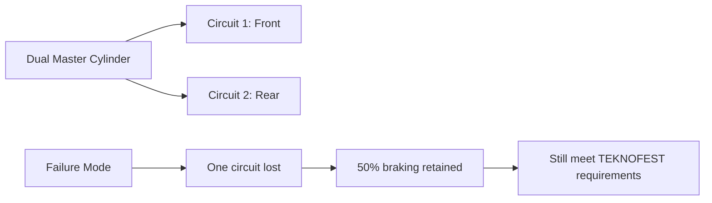
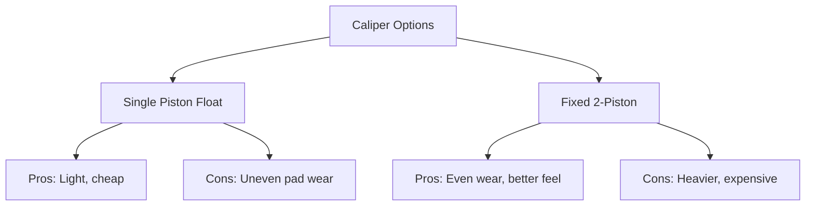
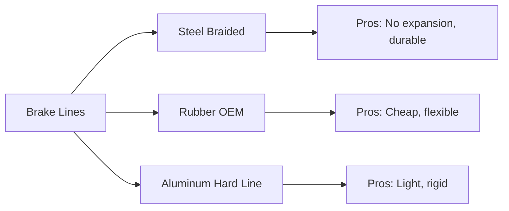
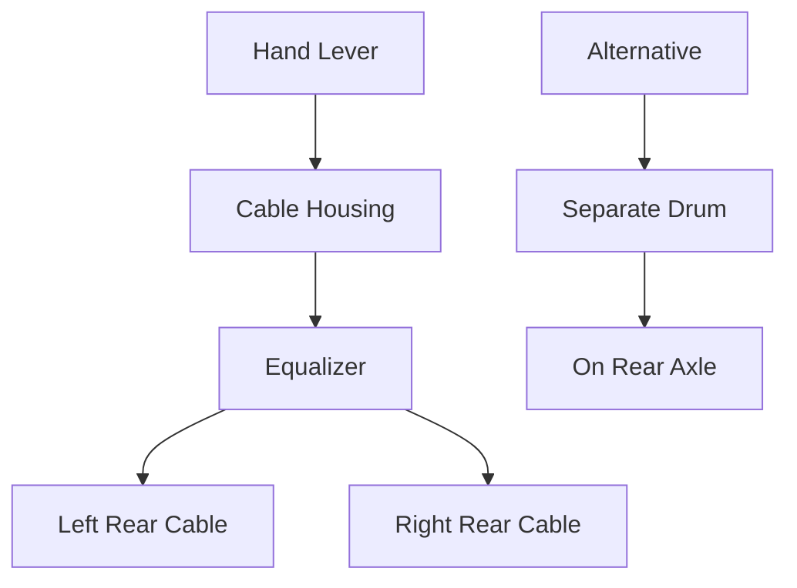
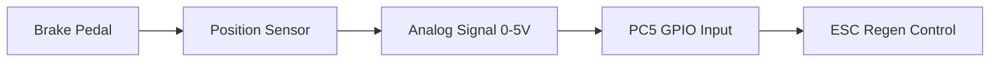
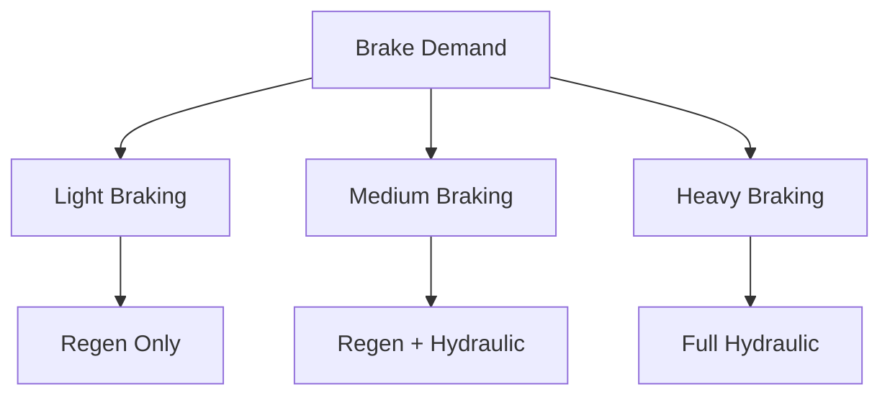

# Fren Sistemi

#mekanik #fren #güvenlik #hydraulic #regenerative

## Genel Bakış

Efficiency Challenge için optimize fren sistemi. Hydraulic disc brakes + regenerative braking integration.

> [!important] Güvenlik Kritik
> - **Primary:** Hydraulic disc brakes (mechanical backup)
> - **Secondary:** Regenerative braking integration
> - **Emergency:** Independent parking brake
> - **Test:** Every wheel lock capability required

## System Architecture



## Brake Type Selection

### Hydraulic Disc (Recommended)
**Advantages:**
- Proven technology
- Linear feel and modulation
- Good heat dissipation
- TEKNOFEST rule compliance
- Maintenance friendly

**Disadvantages:**
- Weight (~3-4kg system)
- Complexity vs drum brakes
- Fluid maintenance required

### Drum Brakes (Alternative)
**Advantages:**
- Lower cost
- Self-energizing effect
- Protected from elements
- Lighter individual components

**Disadvantages:**
- Heat fade susceptibility
- Less modulation
- Harder to integrate regen
- Service access difficulty

### Disc Brake Specifications


## Front/Rear Distribution

### Brake Balance
**Target distribution:**
- **Front:** 60-70% of total braking force
- **Rear:** 30-40% of total braking force
- **Reason:** Weight transfer under braking

### Proportioning


**Calculation factors:**
- **Vehicle weight distribution:** Front/rear static
- **Center of gravity height:** Affects weight transfer
- **Wheelbase:** Longer = more transfer
- **Regenerative contribution:** Reduces rear brake need

## Master Cylinder Sizing

### Sizing Calculation
```
Pedal Force × Pedal Ratio = Master Cylinder Force
Master Cylinder Force / MC Area = System Pressure
System Pressure × Caliper Area = Clamp Force
```

**Target specs:**
- **Pedal force:** <200N max (driver comfort)
- **Pedal ratio:** 4:1 - 6:1 (pedal lever)
- **System pressure:** 50-80 bar peak
- **Master cylinder diameter:** 15-20mm

### Dual Circuit Safety


**Redundancy:**
- **Dual circuit master cylinder:** Independent front/rear
- **Failure mode:** Single circuit can still stop vehicle
- **Testing:** Block one circuit, verify stopping ability

## Component Selection

### Brake Rotors
**Front rotors:**
- **Diameter:** 220-250mm
- **Thickness:** 10-12mm
- **Venting:** Solid (weight) or vented (cooling)
- **Material:** Cast iron or steel
- **Weight:** ~1.5kg each

**Rear rotors:**
- **Diameter:** 180-220mm 
- **Thickness:** 8-10mm
- **Material:** Cast iron
- **Weight:** ~1kg each

### Brake Calipers


**Selection criteria:**
- **Budget option:** Single piston floating (motorcycle)
- **Performance option:** Fixed 2-piston (automotive)
- **Material:** Aluminum body for weight
- **Piston diameter:** 30-40mm per piston

### Brake Pads
- **Material:** Organic or semi-metallic compound
- **Operating temperature:** 150-300°C max
- **Fade resistance:** Important for repeated testing
- **Dust generation:** Low dust preferred
- **Bedding procedure:** Required for optimal performance

## Brake Line Routing

### Line Material Options


**Recommended:** Steel braided flex + aluminum hard lines
- **Hard lines:** Chassis-mounted sections
- **Flex lines:** Suspension travel areas
- **Fittings:** AN-3 or metric banjo bolts
- **Protection:** Cable guards in high-risk areas

### Routing Considerations
- **Heat sources:** Keep lines away from exhaust/motor
- **Moving parts:** Allow for suspension travel
- **Protection:** Guard against road debris
- **Accessibility:** Service access for bleeding
- **Restraint:** Proper mounting clips every 300mm

## Emergency/Parking Brake

### Mechanical Cable System


**Primary option:** Mechanical actuation of rear calipers
- **Lever:** Hand or foot operated
- **Cable:** Bowden cable with adjusters
- **Integration:** Mechanical actuator on hydraulic calipers
- **Force:** Must lock rear wheels independently

**Alternative:** Separate parking brake drums
- **Advantage:** Independent of service brakes
- **Disadvantage:** Added weight and complexity

## ESC Integration (PC5 GPIO)

### Brake Signal Generation


**Sensor options:**
1. **Brake light switch:** Simple on/off signal
2. **Position sensor:** Linear potentiometer or hall effect
3. **Pressure sensor:** Hydraulic pressure transducer

**Signal processing:**
- **Input range:** 0-5V analog or digital signal
- **Processing:** PC5 ADC or digital input
- **Output:** Regenerative braking command to ESC
- **Coordination:** Blend hydraulic + regenerative

### Regenerative Braking Coordination


**Strategy:**
- **Light braking (0-20%):** Pure regenerative
- **Medium braking (20-70%):** Blend regen + hydraulic
- **Heavy braking (>70%):** Full hydraulic + limited regen
- **Emergency:** Pure hydraulic (regen cutoff)

## Build Checklist

### Design & Sizing
- [ ] Brake force calculations completed
- [ ] Master cylinder sizing verified
- [ ] Rotor/caliper sizing finalized
- [ ] Brake balance front/rear determined
- [ ] Pedal ratio calculated
- [ ] Integration with regen defined

### Procurement
- [ ] Master cylinder (dual circuit)
- [ ] Brake rotors (front/rear pairs)
- [ ] Brake calipers (2 or 4 total)
- [ ] Brake pads (2 sets front + rear)
- [ ] Brake lines and fittings
- [ ] Brake fluid (DOT 4 minimum)
- [ ] Parking brake components
- [ ] Brake pedal and linkage

### Installation
- [ ] Rotors mounted to hubs
- [ ] Calipers mounted to brackets
- [ ] Master cylinder mounted
- [ ] Brake lines routed and connected
- [ ] Pedal assembly installed
- [ ] Parking brake cables installed
- [ ] Brake signal sensor installed

### System Testing
- [ ] Brake system bleeding completed
- [ ] Pedal feel verification (firm, no sponginess)
- [ ] Static lock test (each wheel independently)
- [ ] Rolling stop test (low speed)
- [ ] Brake balance verification
- [ ] Emergency stop test
- [ ] Parking brake hold test

### Integration Testing
- [ ] Brake signal to PC5 verified
- [ ] Regenerative braking coordination tested
- [ ] Blend mode operation validated
- [ ] Emergency cutoff functionality verified
- [ ] Data logging of brake/regen forces

### Competition Prep
- [ ] Brake fluid level checked
- [ ] Pad thickness measured (>50% remaining)
- [ ] Line inspection (no leaks/damage)
- [ ] Parking brake adjustment verified
- [ ] Spare pads and fluid packed
- [ ] Bleeding kit available

### TEKNOFEST Compliance
- [ ] Individual wheel lock capability verified
- [ ] Emergency brake independence confirmed
- [ ] Brake system documentation complete
- [ ] Safety inspection checklist reviewed
- [ ] Judge demonstration procedure practiced

---

**Related:** [[Sasi]] | [[AKS-Board]] | [[Tekerlekler]] | [[Guvenlik]]
**Tags:** #mekanik #fren #güvenlik #hydraulic #regenerative
**Owner:** Mekanik + Elektronik teams
**Dependencies:** ESC board, PC5 integration, chassis mount points
**Status:** Design phase
**Critical:** Safety system - high priority testing
**Last updated:** {{date}}