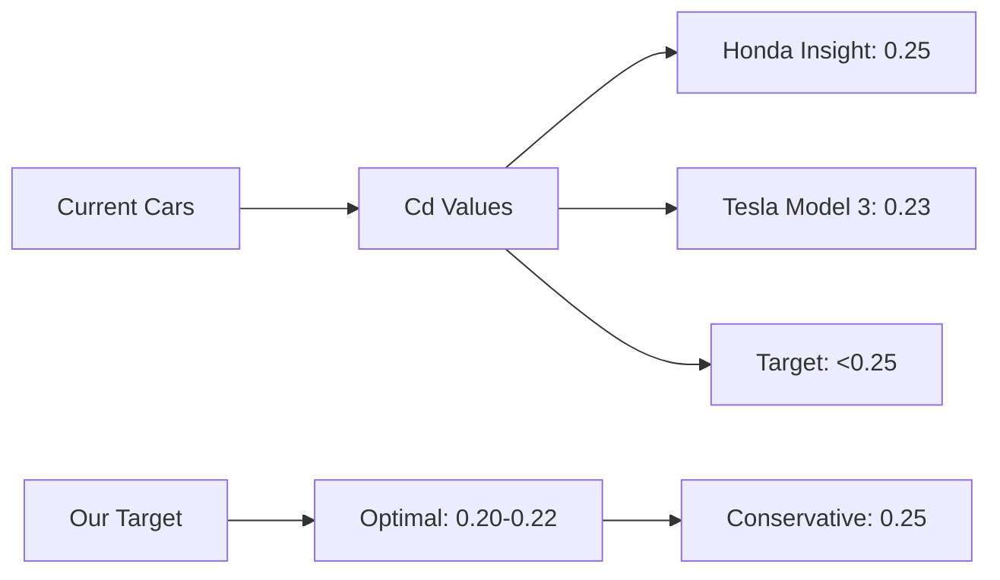
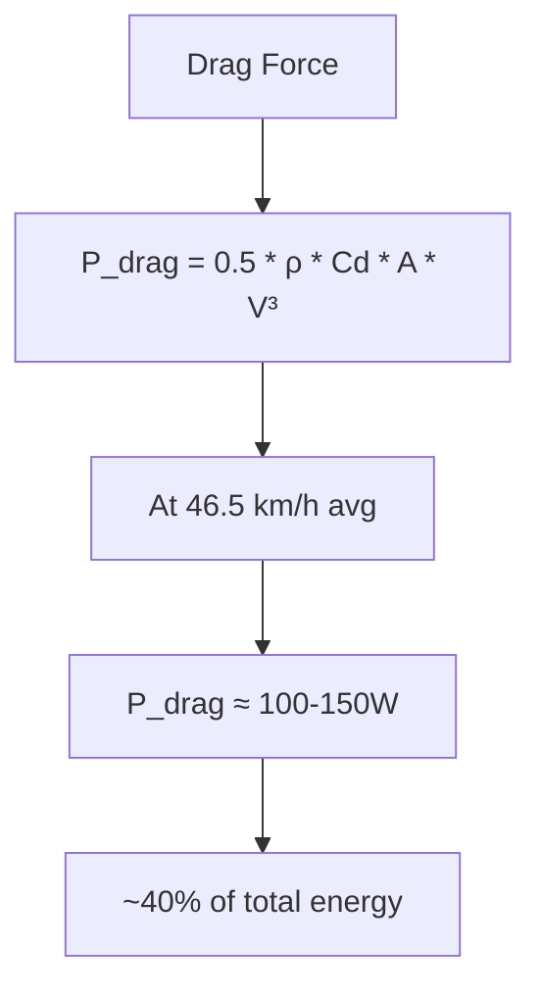
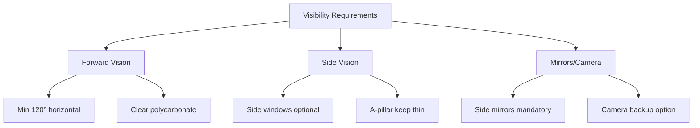
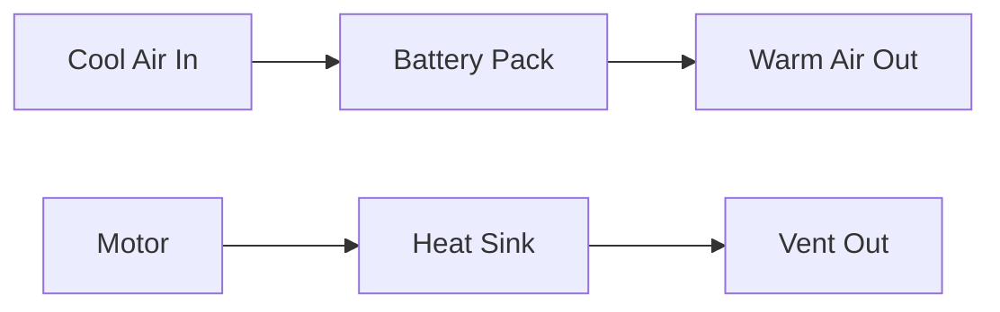
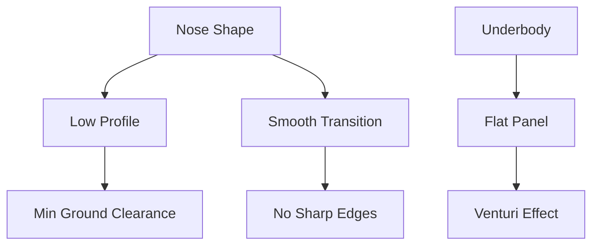

# Gövde Tasarımı

#mekanik #gövde #aerodinamik #cfd

## Genel Bakış

Efficiency Challenge için aerodinamik optimized gövde tasarımı. Cd < 0.25 hedefi ile minimum drag, maksimum range.

> [!note] Hedef Değerler
> - **Drag Coefficient:** Cd < 0.25
> - **Frontal Area:** <1.2 m²
> - **CdA Hedefi:** <0.30 m²
> - **Ağırlık:** <15kg (gövde panelleri)

## Aerodynamic Targets

### Drag Coefficient (Cd)

### Frontal Area Minimization
- **Width:** 1400mm (track width + clearance)
- **Height:** ~1200mm (driver + rollbar + ground clearance)
- **Target frontal area:** 1.0-1.2 m²

### Energy Impact

## Body Panel Materials

### Option 1: Fiberglass
**Pros:**
- Proven technology
- Good surface finish
- Moderate cost
- Yerli temin possible

**Cons:**
- Heavier than alternatives (~12-15kg)
- Labor intensive

**Specs:**
- **Resin:** Polyester or vinyl ester
- **Fabric:** 450-600 gsm woven roving
- **Thickness:** 3-4mm
- **Maliyet:** ₺3000-5000

### Option 2: Carbon Fiber
**Pros:**
- Lightest option (~6-8kg)
- Premium finish
- High strength

**Cons:**
- Expensive (₺15000-20000)
- Requires autoclave/prepreg
- Limited yerlilik

**Specs:**
- **Fabric:** 200-400 gsm plain/twill weave
- **Resin:** Epoxy (120°C cure)
- **Core:** Nomex honeycomb (optional)
- **Thickness:** 2-3mm

### Option 3: Foam + Resin
**Pros:**
- Lightweight (~8-10kg)  
- Easy shaping
- Cost effective
- Good insulation

**Cons:**
- Less durable
- Repair challenges
- Finish quality

**Specs:**
- **Core:** PU foam 20-40 kg/m³
- **Skin:** 2x 300gsm glass + polyester resin
- **Thickness:** 10-15mm total
- **Maliyet:** ₺2000-3000

## Design Requirements

### Windshield/Visibility

- **Material:** Polycarbonate 4-6mm (not glass - weight)
- **Shape:** Aerodynamic integration kritik
- **Mounting:** Rubber gasket + structural adhesive
- **Rain:** Hydrophobic coating consider

### Cooling Vents

#### Motor Compartment
- **Location:** Rear/side panels
- **Size:** 200-300 cm² inlet area
- **Design:** NACA ducts or simple louvers
- **Filtering:** Mesh to prevent debris

#### Battery Compartment  
- **Requirement:** IP rating koruma + thermal management
- **Inlet:** Bottom/front (cool air)
- **Outlet:** Top/rear (warm air exit)
- **Fan:** 12V computer fan if needed

### Rain Drainage
- **Door seals:** EPDM rubber gasket
- **Panel joints:** Overlap + sealant
- **Drainage channels:** Water exit routes
- **Floor protection:** Sealed bottom panel

## Aerodynamic Features

### Nose Design

- **Profile:** Low, pointed nose
- **Underbody:** Flat panels for smooth airflow
- **Front splitter:** Small lip for downforce/balance

### Rear Design
- **Kamm tail:** Truncated for optimal Cd
- **Angle:** ~15-20° taper max
- **Height:** Gradual reduction to minimize separation

### Wheel Wells
- **Covers:** Partial or full wheel fairings
- **Clearance:** Min steering lock + suspension travel
- **Mounting:** Removable for service access

## Build Checklist

### Design Phase
- [ ] Aerodynamic concept finalized
- [ ] CFD analysis completed (target Cd < 0.25)
- [ ] Visibility requirements verified
- [ ] Cooling analysis done
- [ ] Weight budget allocated (<15kg)
- [ ] Material selection completed
- [ ] Manufacturing method chosen

### Mold/Tooling
- [ ] Plug design completed (male/female)
- [ ] Mold material selected (fiberglass/aluminum)
- [ ] Surface finish specified (gelcoat/clear coat)
- [ ] Release agent procurement
- [ ] Tooling dimensional accuracy checked

### Layup Process
- [ ] Fabric cutting patterns prepared
- [ ] Resin mixing ratios calculated
- [ ] Curing schedule defined
- [ ] Quality control checkpoints set
- [ ] Safety equipment ready (ventilation, PPE)

### Assembly Integration
- [ ] Mounting points marked/drilled
- [ ] Panel fit and finish checked
- [ ] Hardware (fasteners, hinges) installed
- [ ] Weatherproofing applied
- [ ] Weight measurement completed

### Testing & Validation
- [ ] Water leak test (hose/spray test)
- [ ] Structural integrity check
- [ ] Visibility test (driver position)
- [ ] Aerodynamic validation (coast-down or CFD correlation)
- [ ] Final weight vs budget

### Competition Prep
- [ ] Surface preparation (cleaning/polishing)
- [ ] Graphics application ready
- [ ] Spare panel inventory
- [ ] Repair kit prepared
- [ ] Transport protection plan

---

**Related:** [[Sasi]] | [[CFD-Analiz]] | [[Agirlik-Dagilimi]]
**Tags:** #mekanik #gövde #aerodinamik #cfd #malzeme
**Owner:** Teknik Çizim + Malzeme & Sim teams
**Dependencies:** Chassis design, CFD results
**Status:** Design phase
**Target Cd:** <0.25
**Last updated:** {{date}}