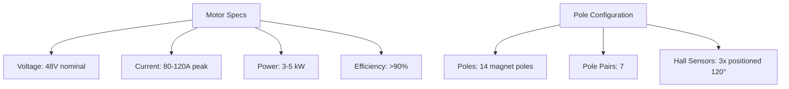
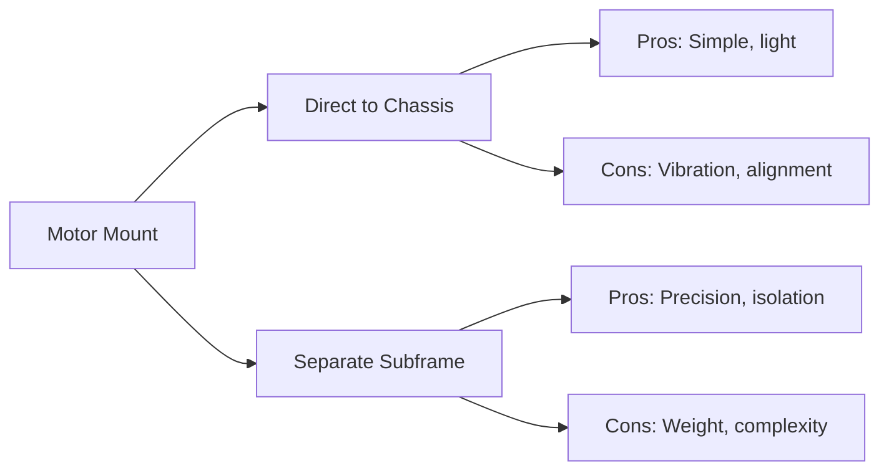
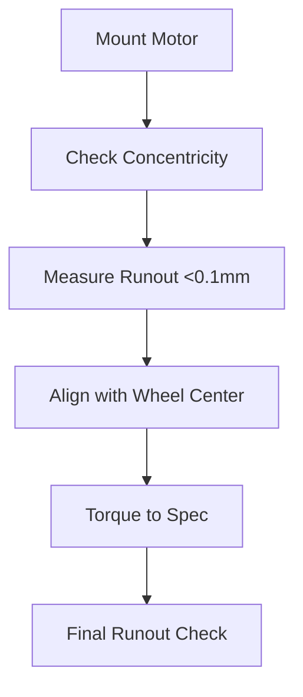
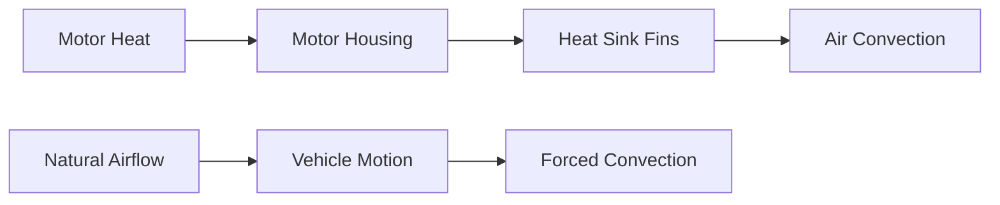
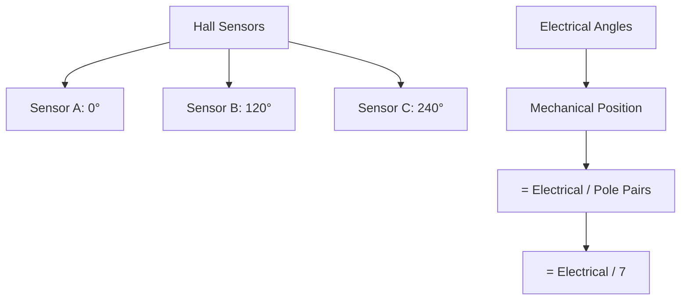
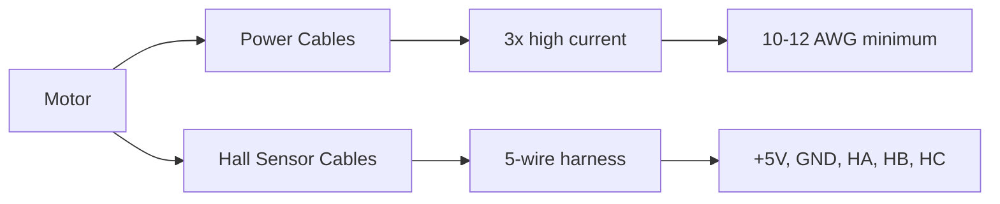

# Motor Montajı

#mekanik #motor #bldc #montaj #soğutma

## Genel Bakış

BLDC motor montaj detayları, soğutma sistemi ve ESC board'a bağlantı. Direct drive konfigürasyon önerisi.

> [!important] Kritik Specs
> - **Motor Type:** BLDC (Brushless DC)
> - **Voltage:** 48V nominal (42-58.8V range)
> - **Pole Pairs:** 7 (14 poles total)
> - **Hall Sensors:** 120° electrical spacing
> - **Cooling:** Passive + optional active

## BLDC Motor Specifications

### Electrical Specs

| Parameter | Value | Unit | Note |
|-----------|-------|------|------|
| **Nominal Voltage** | 48 | V | 13S battery config |
| **Peak Current** | 100-120 | A | Short burst capability |
| **Continuous Current** | 60-80 | A | Thermal limited |
| **Power (peak)** | 5000 | W | Acceleration phase |
| **Power (cruise)** | 2000-3000 | W | Efficiency target |
| **Efficiency** | >92% | % | At operating point |
| **Speed** | 800-1200 | RPM | Direct drive |
| **Torque** | 40-60 | N⋅m | Wheel rim |

### Motor Selection Options

#### Option 1: QS Motor 3000W
- **Model:** QS138 70H or similar
- **Power:** 3000W continuous, 5000W peak
- **Weight:** ~9kg
- **Diameter:** ~138mm
- **Cost:** ₺8000-12000

#### Option 2: Custom Outrunner
- **Advantage:** Optimized for efficiency challenge
- **Power:** 2000-3000W
- **Weight:** ~6-8kg  
- **Cost:** ₺15000-20000 (development)
- **Risk:** Development time/reliability

#### Option 3: Modified RC Motor
- **Base:** Large scale RC outrunner
- **Modification:** Enhanced cooling, better bearings
- **Power:** 2000W continuous
- **Weight:** ~3-4kg
- **Cost:** ₺3000-5000
- **Risk:** Durability for 29min run

## Motor Mount Design

### Mounting Strategy

### Material Selection
- **Primary:** 6061-T6 aluminum plate (10-12mm thickness)
- **Alternative:** Steel plate (8-10mm) for cost
- **Weight target:** <2kg total mount system

### Bolt Pattern
- **Motor side:** M8 or M10 bolts (motor dependent)
- **Chassis side:** M10 bolts to main frame
- **Thread locker:** Loctite 243 (medium strength)
- **Torque specs:** Per motor manufacturer + 10%

### Alignment Procedure

1. **Rough Positioning:** Motor center to wheel center
2. **Fine Alignment:** Dial indicator on motor shaft
3. **Runout Check:** <0.1mm total indicated runout
4. **Final Torque:** Sequence tightening (star pattern)

## Motor-to-Wheel Coupling

### Direct Drive (Recommended)
**Pros:**
- Highest efficiency (no transmission losses)
- Minimal complexity
- Lowest weight
- Silent operation

**Cons:**
- Motor must handle low RPM/high torque
- Limited gear reduction options

### Chain/Belt Drive (Backup)
**Chain:**
- **Ratio:** 1:1 to 1:3 reduction
- **Type:** #25 or #35 roller chain
- **Efficiency:** ~96-98%
- **Maintenance:** Lubrication, tension

**Belt:**
- **Type:** Timing belt (GT2/GT3)
- **Ratio:** 1:1 to 1:2 reduction
- **Efficiency:** ~98%
- **Maintenance:** Minimal

## Cooling System

### Passive Cooling

**Heat Sink Design:**
- **Material:** Aluminum extrusion or machined
- **Fins:** 2-3mm thick, 20-30mm tall
- **Surface area:** Target 0.5-1.0 m² total
- **Attachment:** Thermal paste + mechanical fastener

### Active Cooling (Optional)
**When needed:** 
- Peak power >3kW sustained
- Ambient temperature >35°C
- Motor temperature >80°C

**Fan Specs:**
- **Type:** 120mm PC case fan (12V)
- **Airflow:** 50-100 CFM
- **Power:** 5-10W
- **Control:** Temperature switch or PWM from ESC

### Temperature Monitoring
- **Sensor:** Thermistor or thermocouple
- **Location:** Motor housing (magnet area)
- **Monitoring:** ESC temperature input
- **Limits:** Warning 70°C, cutoff 85°C

## Hall Sensor Mounting

### Sensor Positioning

**Electrical Spacing:** 120° (for 3-phase BLDC)
**Mechanical Spacing:** 120° / 7 = ~17.14°
**Tolerance:** ±2° maximum

### Sensor Installation
- **Type:** Linear Hall effect (A1301/A1302 or similar)
- **Supply:** 3.3V or 5V from ESC
- **Signal:** Analog 0.5-4.5V or digital
- **Distance from magnets:** 1-3mm (optimize signal)
- **Protection:** IP65 rated or sealed housing

## Wiring & Cable Management

### Motor to ESC Connection

**Power Cables:**
- **Size:** 10-12 AWG per phase (3 total)
- **Type:** Stranded copper, silicone insulation
- **Length:** <1m to minimize resistance
- **Connectors:** Anderson Powerpole or XT60/XT90
- **Color code:** U(Red), V(Yellow), W(Blue)

**Hall Sensor Cables:**
- **Type:** Shielded 5-conductor
- **Wire gauge:** 22-24 AWG
- **Length:** <1.5m for signal integrity
- **Connector:** JST-XH or similar
- **Pinout:** +5V(Red), GND(Black), HA(Yellow), HB(Green), HC(Blue)

### Cable Routing
- **Separation:** Keep power and signal cables apart (>50mm)
- **Protection:** Cable loom/conduit in high-vibration areas
- **Strain relief:** At both motor and ESC connections
- **Waterproofing:** IP65 minimum rating for connections

## Build Checklist

### Design & Procurement
- [ ] Motor specifications finalized
- [ ] Mount design completed and FEA verified
- [ ] Heat sink designed (passive cooling)
- [ ] Cable sizes calculated for current
- [ ] Connectors selected for current rating
- [ ] Temperature monitoring planned

### Manufacturing
- [ ] Motor mount machined/fabricated
- [ ] Heat sink fabricated or procured
- [ ] All fasteners procured (stainless steel)
- [ ] Cables cut to length and terminated
- [ ] Thermal paste/compound procured

### Assembly
- [ ] Motor mounted to heat sink
- [ ] Mount assembly torqued to specification
- [ ] Motor shaft runout measured (<0.1mm)
- [ ] Hall sensors positioned and secured
- [ ] Power cables connected and secured
- [ ] Hall sensor cable connected

### Testing & Commissioning
- [ ] Hall sensor signals verified (scope/DMM)
- [ ] Motor resistance measured (phase-to-phase)
- [ ] Insulation resistance tested (>1MΩ)
- [ ] Temperature sensors calibrated
- [ ] ESC motor detection run successfully
- [ ] Motor direction verified (forward command)

### Integration Testing
- [ ] Full power test on dynamometer/bench
- [ ] Temperature rise test (30min at 50% power)
- [ ] Vibration test (road simulation)
- [ ] Efficiency measurement at operating points
- [ ] Emergency stop functionality verified

### Competition Prep
- [ ] All connections double-checked
- [ ] Cable ties and dress properly secured
- [ ] Spare connectors and cables packed
- [ ] Motor temperature monitoring active
- [ ] Cooling system operational check

---

**Related:** [[AKS-Board]] | [[Sasi]] | [[Enerji-Simulasyon]]
**Tags:** #mekanik #motor #bldc #montaj #soğutma #hall-sensor
**Owner:** Elektronik + Mekanik teams
**Dependencies:** ESC board design, chassis mount points
**Status:** Component selection phase
**Last updated:** {{date}}