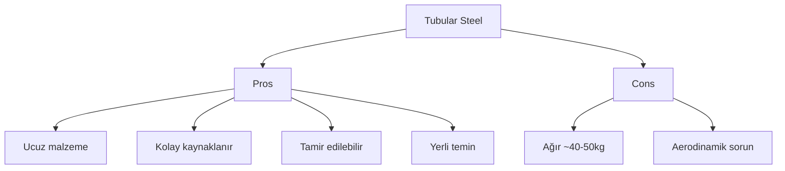
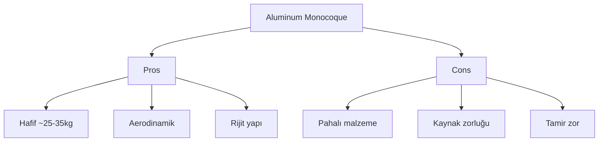
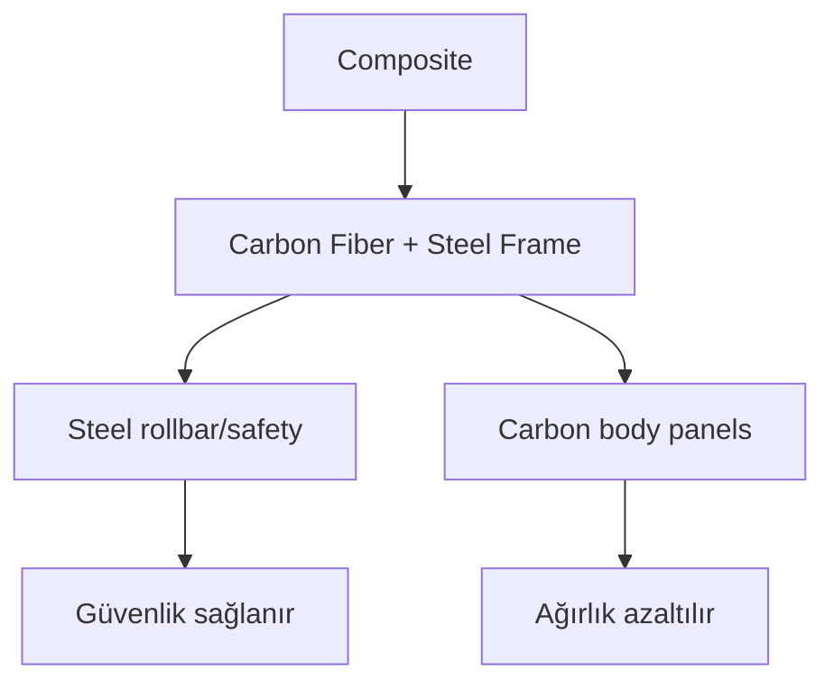
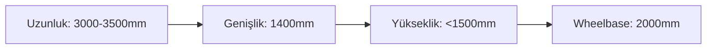
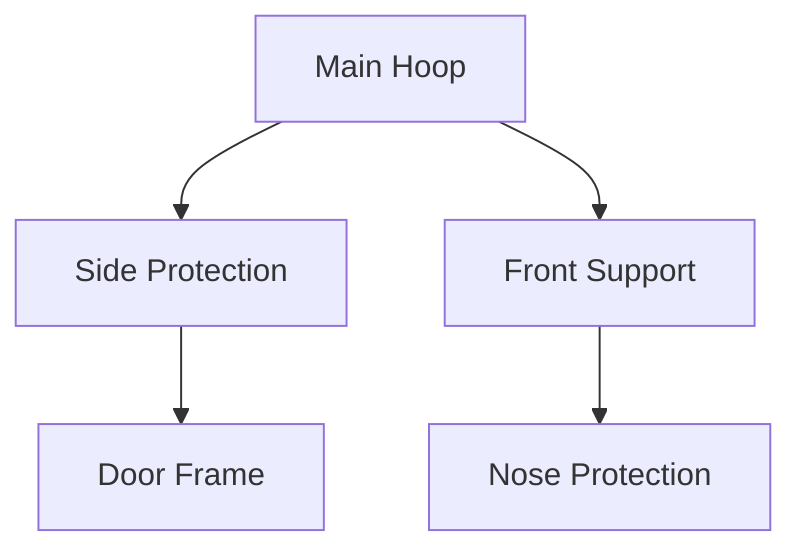

# Şasi Tasarımı

#mekanik #şasi #güvenlik #fea

## Genel Bakış

TEKNOFEST Efficiency Challenge için şasi tasarımı. Toplam araç ağırlığı <200kg hedefi ile hafif ama güvenli yapı.

> [!important] Kritik Noktalar
> - Toplam ağırlık hedefi: **<200kg**
> - Güvenlik faktörü: **≥2.0**
> - Rollbar zorunlu (TEKNOFEST kuralı)
> - Pilot güvenliği #1 öncelik

## Şasi Türü Seçenekleri

### 1. Tubular Steel (Borulu Çelik)

- **Malzeme:** ST37 veya S235 çelik boru
- **Çap/et:** 25-40mm dış, 2-3mm et kalınlığı
- **Ağırlık tahmini:** 40-50kg
- **Maliyet:** ₺2000-3000
- **Yerlilik:** %100 yerli

### 2. Aluminum Monocoque

- **Malzeme:** 6061-T6 alüminyum levha
- **Kalınlık:** 2-3mm
- **Ağırlık tahmini:** 25-35kg
- **Maliyet:** ₺8000-12000
- **Yerlilik:** Malzeme ithal, imalat yerli

### 3. Composite (Karma)

- **Hybrid:** Çelik güvenlik kafesi + karbon fiber paneller
- **Ağırlık tahmini:** 30-40kg
- **Maliyet:** ₺15000-20000
- **Geliştirme süresi:** En uzun

## Malzeme Seçim Kriterleri

| Kriter | Ağırlık | Steel | Aluminum | Composite |
|--------|---------|-------|----------|-----------|
| **Ağırlık** | 30% | 6/10 | 9/10 | 8/10 |
| **Maliyet** | 25% | 9/10 | 6/10 | 4/10 |
| **Üretim** | 20% | 9/10 | 7/10 | 5/10 |
| **Güvenlik** | 15% | 8/10 | 8/10 | 7/10 |
| **Yerlilik** | 10% | 10/10 | 7/10 | 6/10 |
| **TOPLAM** | | **7.65** | **7.35** | **5.95** |

## Boyutlar

### Wheelbase (Dingil Mesafesi)
- **Hedef:** 1800-2200mm
- **Optimum:** ~2000mm
- **Sebep:** Stability vs maneuverability balance

### Track Width (İz Genişliği)
- **Ön:** 1200-1400mm
- **Arka:** 1200-1400mm (ön = arka önerilen)
- **Sınırlar:** TEKNOFEST kurallarına göre max genişlik

### Yükseklik
- **Toplam araç:** <1500mm (aerodynamik için)
- **Pilot oturma:** ~400mm (rollbar altı)
- **Ground clearance:** 80-120mm

### Genel Boyutlar

## Montaj Noktaları

### Motor Montajı
- **Konum:** Arka tekerlek yakını (direct drive için)
- **Malzeme:** 10mm çelik plaka
- **Güçlendirme:** Motor momentine karşı
- **Soğutma:** Hava akışı sağlanmalı

### Batarya Bölmesi
- **Konum:** Şasi ortası (center of gravity)
- **Koruma:** IP67 kasa gerekli
- **Montaj:** Alt çerçeveye 8-10 noktadan
- **Erişim:** Servis için açılabilir kapak

### Süspansiyon Montajları
- **Ön:** Double wishbone için 6 nokta
- **Arka:** Trailing arm veya wishbone
- **Malzeme:** Yüksek dayanımlı çelik
- **FEA gerekli:** Tüm yük noktaları

### Pilot Koltuğu
- **Konum:** Aerodynamics için alçak pozisyon
- **Güvenlik:** 4-nokta kemer montajı
- **Ayarlama:** Pilot boyuna göre 100mm hareket
- **Rollbar mesafe:** Min 50mm kafa üstü

## FEA Gereksinimleri

### Load Cases (Yük Durumları)
1. **Static Load**
   - Vertical: 4g (gravitational load)
   - Lateral: 2.5g (cornering)
   - Longitudinal: 3g (braking/acceleration)

2. **Dynamic Load**
   - Bump impact: 6g vertical
   - Rollover: 1.5x vehicle weight lateral

3. **Safety Tests**
   - Rollbar compression: 2x vehicle weight
   - Side impact: 1.5x vehicle weight

### Güvenlik Faktörleri
> [!warning] Minimum Safety Factor
> - **Şasi ana yapı:** SF ≥ 2.0
> - **Süspansiyon montajları:** SF ≥ 2.5
> - **Rollbar:** SF ≥ 3.0

### Software
- **Primary:** ANSYS Mechanical
- **Alternative:** SolidWorks Simulation
- **Mesh:** Tetrahederal, 5-10mm element size
- **Material:** Elastic modulus, Poisson ratio, yield strength

## Rollbar Gereksinimleri

### TEKNOFEST Kuralları
- [ ] Pilot kafasının 50mm üstünde
- [ ] Ön-arka bağlantılı (continuous roll hoop)
- [ ] Minimum boru çapı: 25mm, et: 2.5mm
- [ ] Material: minimum ST37 çelik
- [ ] Kaynak kalitesi: EN ISO 3834-2

### Tasarım Detayları

## Build Checklist

### Tasarım Aşaması
- [ ] Concept tasarımı tamamlandı
- [ ] 3D model oluşturuldu (SolidWorks/Fusion)
- [ ] FEA analizi yapıldı
- [ ] Safety factor doğrulandı (≥2.0)
- [ ] Ağırlık hesabı yapıldı (<50kg target)
- [ ] TEKNOFEST kuralları kontrol edildi
- [ ] Rollbar tasarımı onaylandı

### Malzeme Tedariki
- [ ] Malzeme spesifikasyonu hazırlandı
- [ ] Tedarikçi seçimi yapıldı
- [ ] Yerlilik belgeleri alındı
- [ ] Malzeme kalite sertifikaları kontrol edildi
- [ ] Delivery planı oluşturuldu

### İmalat Aşaması
- [ ] Cutting plan hazırlandı
- [ ] Welding procedure spec (WPS) hazırlandı
- [ ] Welding consumables seçildi
- [ ] Jig/fixture tasarımı yapıldı
- [ ] Pre-fit assembly test

### Kalite Kontrol
- [ ] Dimensional inspection
- [ ] Weld quality check (visual + NDT)
- [ ] Surface finish inspection
- [ ] Weight measurement
- [ ] Mounting point alignment check

### Final Assembly
- [ ] Motor mount installation test
- [ ] Battery compartment fit check
- [ ] Suspension mount alignment
- [ ] Driver position validation
- [ ] Safety system integration test

### Test & Validation
- [ ] Static load test (bags/weights)
- [ ] Rollbar compression test
- [ ] Overall vehicle weight check (<200kg)
- [ ] Driver egress test (5 seconds)
- [ ] Final inspection by safety officer

---

**Links:** [[Govde]] | [[Motor-Montaj]] | [[Suspansiyon]] | [[Agirlik-Dagilimi]]
**Tags:** #mekanik #şasi #güvenlik #fea #rollbar
**Owner:** Teknik Çizim Team
**Status:** Design phase
**Last updated:** {{date}}