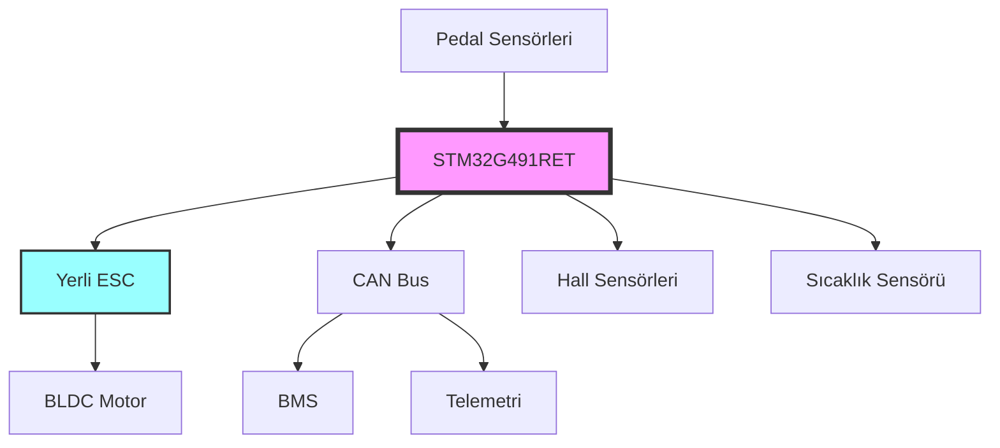

# 🏠 AVT Racing Team - Elektromobil 2026 Dashboard

> **TEKNOFEST Efficiency Challenge 2026 - Elektromobil Kategorisi**  
> **Hedef:** <110 Wh/km enerji verimliliği

## 🚨 Kritik Durum

```dataview
task
where contains(tags, "critical") and !completed
```

---

## 📊 Proje Durumu

| Kategori | Durum | Son Güncelleme |
|----------|-------|----------------|
| **Genel Progress** | [[00-dashboard/Proje-Durumu\|🟡 %65]] | 2026-03-28 |
| **Elektronik** | [[01-elektronik/AKS-Board\|🟢 %85]] | 2026-03-27 |
| **Yazılım** | [[02-yazilim/CubeMX-Config\|🟡 %70]] | 2026-03-28 |
| **Mekanik** | [[03-mekanik/Sasi\|🔴 %45]] | 2026-03-26 |
| **Simulasyon** | [[04-simulasyon/FEA-Analiz\|🟡 %60]] | 2026-03-25 |

## ⏰ Kritik Deadline'lar

- **Apr 15, 2026:** PCB üretim siparişi son tarih
- **May 1, 2026:** İlk prototip testi
- **Jun 1, 2026:** Entegrasyon testi başlangıç
- **Jul 7, 2026:** Teknik Tasarım Raporu teslimi ⚠️
- **Aug 24-31, 2026:** TEKNOFEST Yarışması 🏁

→ **[[TIMELINE\|Detaylı Timeline]]**

---

## 🏗️ Sistem Mimarisi



---

## 🔧 Takım Bölümleri

### 🔌 Elektronik Takımı
- **[[01-elektronik/AKS-Board\|AKS PCB]]** - STM32G491RET ana kart
- **[[01-elektronik/Guc-Kati\|Güç Katı]]** - MOSFET bridge, gate driver'lar
- **[[01-elektronik/Batarya\|Batarya]]** - 3kWh limit, BMS entegrasyonu
- **[[01-elektronik/CAN-Bus\|CAN Bus]]** - İletişim protokolü
- **[[01-elektronik/Malzeme-Listesi\|BOM]]** - Tam malzeme listesi

### 💻 Yazılım Takımı
- **[[02-yazilim/CubeMX-Config\|CubeMX Config]]** - Peripheral konfigürasyonu
- **VCU Layer:** [[02-yazilim/vcu-pedal\|Pedal]] • [[02-yazilim/vcu-state\|State]] • [[02-yazilim/vcu-can\|CAN]]
- **ESC Layer:** [[02-yazilim/esc-commutation\|Commutation]] • [[02-yazilim/esc-motor-control\|Motor Control]] • [[02-yazilim/esc-sensors\|Sensors]]
- **[[02-yazilim/Test-Proseduru\|Test Prosedürü]]** - 7 test adımı

### 🔩 Mekanik Takımı
- **[[03-mekanik/Sasi\|Şasi]]** - Ana yapı, FEA analizi
- **[[03-mekanik/Motor-Montaj\|Motor Montajı]]** - Hizalama, soğutma
- **[[03-mekanik/Fren-Sistemi\|Fren Sistemi]]** - Güvenlik kritik
- **[[03-mekanik/Agirlik-Dagilimi\|Ağırlık Dağılımı]]** - CG optimizasyonu

### 📊 Simulasyon Takımı
- **[[04-simulasyon/Enerji-Simulasyon\|Enerji Simulasyonu]]** - <110 Wh/km hedefi
- **[[04-simulasyon/Yaris-Strateji\|Yarış Stratejisi]]** - P&G vs sabit hız

---

## 📋 Bugünkü Öncelikler

### Elektronik #critical
- [ ] AKS PCB Gerber dosyalarını finalize et
- [ ] Gate driver IC seçimini tamamla
- [ ] Current sense amplifier testini yap

### Yazılım #critical  
- [ ] Hall sensör commutation tablosunu test et
- [ ] CAN message ID'lerini standardize et
- [ ] Overcurrent protection threshold'larını belirle

### Mekanik #blocked
- [ ] Şasi malzemesi tedarikini çöz (sponsor bekliyor)
- [ ] Motor montaj braketini tasarla
- [ ] Wheel hub tasarımını finalize et

---

## 🚧 Aktif Blocker'lar

→ **[[00-dashboard/Blocker-Takibi\|Tüm Blocker'ları Görüntüle]]**

1. **Şasi Malzemesi** - Sponsor onayı bekleniyor (Carbon fiber)
2. **PCB Üretim Fiyatı** - 3 farklı üreticiden teklif alınıyor
3. **Motor Tedariki** - Gümrük süreçleri uzun sürüyor

---

## 📞 İletişim

- **WhatsApp:** [[06-takim/Iletisim\|AVT Elektromobil 2026 Grubu]]
- **GitHub:** [avt-racing/elektrikli-arac-2026](https://github.com/avt-racing/elektrikli-arac-2026)
- **Drive:** [[06-takim/Iletisim\|Paylaşılan dosyalar]]

---

## 📚 Hızlı Başvuru

| Konu | Link | Konu | Link |
|------|------|------|------|
| Pin Map | [[02-yazilim/CubeMX-Config\|CubeMX]] | BOM | [[01-elektronik/Malzeme-Listesi\|Components]] |
| Test Prosedürü | [[02-yazilim/Test-Proseduru\|7 Steps]] | Kurallar | [[05-yaris-hazirlik/Kurallar\|TEKNOFEST]] |
| Ekip | [[06-takim/Ekip-Listesi\|22 kişi]] | Sponsorlar | [[07-sponsorluk/Potansiyel-Sponsorlar\|Target List]] |

---

> **💡 Son Güncelleme:** 2026-03-28 20:39 UTC  
> **📝 Güncelleme Yapan:** Vault Admin  
> **🎯 Bir sonraki milestone:** PCB Gerber finalize (Apr 15)