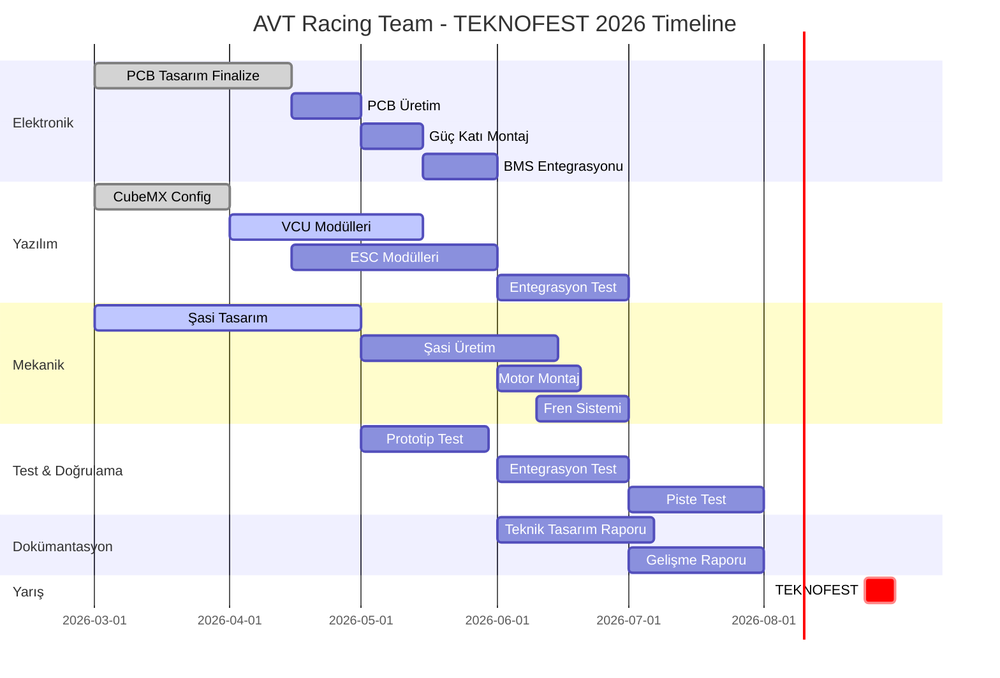

# 📅 TEKNOFEST 2026 - Elektromobil Proje Zaman Çizelgesi

> **Yarış Tarihi:** 24-31 Ağustos 2026  
> **Teknik Tasarım Raporu Deadline:** 7 Temmuz 2026



## 🎯 Kritik Milestone'lar

### ⚡ Nisan 2026
- **Apr 15:** PCB Gerber dosyaları üreticiye gönderilmeli #critical
- **Apr 30:** VCU modüllerinin ilk versiyonu tamamlanmalı

### 🔥 Mayıs 2026  
- **May 1:** İlk PCB'ler eline geçmeli, prototip testine başla
- **May 15:** Şasi üretimi başlamalı
- **May 30:** Motor control algoritmalarının temel versiyonu hazır

### ⚠️ Haziran 2026
- **Jun 1:** BMS entegrasyonu tamamlanmalı
- **Jun 15:** Şasi tamamlanıp motor montajına başlanmalı  
- **Jun 30:** Full entegrasyon testi başlamalı

### 🚨 Temmuz 2026 - CRUNCH TIME
- **Jul 7:** **Teknik Tasarım Raporu teslimi** - GERİ DÖNÜŞÜ YOK! ⚠️
- **Jul 15:** İlk pist testi yapılmalı
- **Jul 31:** Tüm güvenlik testleri geçilmeli

### 🏁 Ağustos 2026 - SHOWTIME
- **Aug 1-20:** Son optimizasyonlar, fine-tuning
- **Aug 21-23:** TEKNOFEST'e gidiş, setup
- **Aug 24-31:** Yarışma dönemı

---

## 📊 Haftalık Milestone Tracking

### Hafta 13 (25-31 Mar 2026) - Mevcut Hafta
- [x] AKS PCB komponenti listesi finalize edildi
- [ ] STM32 pin konfigürasyonu dokümante edildi #todo
- [ ] Motor control algoritması temel yapısı oluşturuldu #todo
- [ ] Şasi malzeme tedarik süreçleri başlatıldı #blocked

### Hafta 14 (1-7 Apr 2026)
- [ ] PCB schematic review tamamlanmalı
- [ ] Hall sensor test prosedürü yazılmalı  
- [ ] Şasi FEA analizi başlamalı
- [ ] BMS haberleşme protokolü belirlenmeli

### Hafta 15 (8-14 Apr 2026)
- [ ] PCB layout finalize edilmeli
- [ ] VCU state machine implementasyonu
- [ ] Motor mounting bracket tasarımı
- [ ] Güvenlik sistemleri tasarımı

### Hafta 16 (15-21 Apr 2026) ⚠️ PCB Deadline
- [ ] Gerber dosyaları üreticiyle paylaşılmalı #critical
- [ ] PCB BOM finalize edilmeli
- [ ] Yazılım test ortamı kurulmalı
- [ ] Şasi prototipi üretilebilir hale gelmeli

---

## 🔄 Risk Matrisi & Contingency Plans

| Risk | Olasılık | Etki | Mitigation |
|------|----------|------|------------|
| PCB üretim gecikmesi | Yüksek | Yüksek | 2 alternatif üretici hazır bekliyor |
| Motor tedarik gecikmesi | Orta | Yüksek | Yedek motor seçenekleri araştırıldı |
| Şasi malzeme yetersizliği | Yüksek | Orta | Alternatif malzemeler listelendi |
| Yazılım entegrasyon sorunları | Orta | Yüksek | Modüler architecture, birim testler |
| Batarya BMS uyumsuzluğu | Düşük | Yüksek | BMS protokolü önceden test edilecek |

---

## 📈 Progress Tracking

```dataview
table
  due as "Deadline",
  status as "Status", 
  assignee as "Sorumlu"
from #milestone
sort due asc
```

---

## 🎯 Günlük Hedefler (Bu Hafta)

### Pazartesi (25 Mar)
- [x] PCB component listesi review
- [x] Pin mapping dokümantasyonu  
- [ ] Hall sensor kalibrasyonu research

### Salı (26 Mar) 
- [ ] STM32CubeMX konfigürasyonu #yazilim
- [ ] Power stage MOSFET seçimi #elektronik
- [ ] Şasi material research #mekanik

### Çarşamba (27 Mar)
- [ ] CAN protocol specification #yazilim
- [ ] Gate driver IC research #elektronik  
- [ ] Brake system design start #mekanik

### Perşembe (28 Mar) - BUGÜN
- [ ] Current sense amplifier test #elektronik
- [ ] VCU state machine design #yazilim
- [ ] Motor mounting analysis #mekanik

### Cuma (29 Mar)
- [ ] PCB schematic review meeting
- [ ] Code architecture discussion
- [ ] Mechanical integration planning

---

## 🔗 Bağlantılı Sayfalar

- **[[00-dashboard/Proje-Durumu\|Güncel Proje Durumu]]**
- **[[00-dashboard/Haftalik-Toplanti\|Haftalık Meeting Template]]**
- **[[00-dashboard/Blocker-Takibi\|Aktif Blocker'lar]]**

---

> **⏰ Son Güncelleme:** 2026-03-28 20:40 UTC  
> **📝 Güncelleme:** Timeline risk matrisi eklendi  
> **🎯 Sonraki önemli milestone:** PCB Gerber teslimi (15 Nisan)